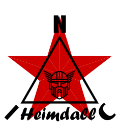

<p align="center">
  
</p>

★ N.I.C. ★

# NIC-Heimdall

[English](README.md) · [Čeština](README.cs.md) · **Русский**

**Аппаратная часть NIC: одна автономная станция, измеряющая явления разной природы, —
измерительные фронты, которые следят за твёрдой Землёй, атмосферой и ионосферой, и центральный
блок, часы, карты, питание и кабели, которые их несут. Массовые компоненты, а данные достаточно
лёгкие, чтобы обрабатывать их на домашнем компьютере.**

[](https://opensource.org/licenses/MIT)
[](https://ohwr.org/cern_ohl_s_v2.txt)


> ⚠️ **Концепция на стадии проектирования — НЕ проверена на железе.** Архитектура, протокол
> передачи и архив проработаны глубоко, а эталонный кодек архива **протестирован на хост-машине**;
> **ничего не было построено или запущено на реальном железе** — ни одна плата не изготовлена, ни
> одной прошивки не написано, ни один датчик не откалиброван. Написано для **опытных сборщиков**:
> здесь топология и обоснования, а не учебник. **Концепция такого объёма БУДЕТ содержать ошибки** —
> согласованность документов между собой ещё не означает правильности. Нашли ошибку? Значит,
> система работает — сверьте её с записью и исправьте запись.

> **Номера компонентов на наших собственных платах — проработанные ориентиры, а не предписание.**
> Документы фиксируют топологию и целевые значения; конкретный компонент конкретного производителя
> выбирает тот, кто собирает. **Покупные датчики вообще никогда не называются по типу** — названный
> компонент — это как раз тот, который сборщик в другой стране не сможет достать. Каждый покупной
> блок задаётся тем, чему он должен соответствовать (*Что покупается*, ниже).

> **Схемы пока нет — описание и есть схема.** Концепция такого объёма развивается в документах,
> а не в EDA: `HARDWARE.md` каждой платы содержит её компоненты, номиналы, выводы и расчёты, на
> которых они основаны. Схемы относятся к шагу от концепции к сборке, и [`schematics/`](schematics/)
> их ждёт. Тот, кто нарисует первую плату, начинает с готового описания, а не с чистого листа, —
> и если это вы, папка ваша. Сквозной нумерации по станции нет; плату находят в её проекте по имени.

*(Архив — HMC, контейнер, и HCC, кодек, — собственный у станции, в
[`core/archive/`](core/archive/HMC.md).)*

## С чего начать

| если хотите узнать | читайте |
|---|---|
| **что она измеряет** | [*Блоки*](#блоки--что-измеряется-и-чем), ниже — по строке на блок, каждая со ссылкой на его папку |
| **как устроена станция** | [*Что такое станция*](#что-такое-станция), затем [`core/`](core/README.md) и [`core/COMMS.md`](core/COMMS.md) — шина, часы, все связи в одной таблице |
| **как данные хранятся и передаются** | [`core/archive/HMC.md`](core/archive/HMC.md), [`EXPORTERS.md`](core/archive/EXPORTERS.md) и [`core/INTEROP.md`](core/INTEROP.md) — архив, его читатели и кто забирает данные |
| **как она собирается** | [`daedalus/`](daedalus/README.md) — станция как сооружение, `HARDWARE.md` каждой платы — сама плата, [`schematics/`](schematics/README.md) — будущие чертежи |
| **почему она такая, какая есть** | `WHY.md` в каждой папке — что пробовали, что отвергли и почему |
| **как помочь и как цитировать** | [`CONTRIBUTING.md`](CONTRIBUTING.md) · [`CITATION.cff`](CITATION.cff) |

## Что такое станция

**Станция — это один шкаф и те фронты, которые нужны площадке.** Внутри шкафа: центральный блок
(Mayak), часы (Kronos), одна или несколько карт (Bifrost / Argus), преобразователь BMS/MPPT
(Hermes), аккумулятор и солнечный контроллер заряда. Каждый кабель, выходящий из шкафа, проходит
через плату Galvani — развязка, защита от перенапряжений и питание. Снаружи: блоки, каждый — своя
плата в своём корпусе, на отводе «точка–точка» (медь до 500 m, дальше стекло), плюс покупные
датчики на ветвях ModBus платы Palatine. **Смените фронты — и это другой прибор на той же шине и с
тем же кодом.** Членство в сети — свойство развёртывания, а не станции: данные передаются уже
существующим сетям (`core/INTEROP.md`).

```
   sky
    │
    ▼
 ┌────────┐   PPS + label   ┌────────┐   4 trunks   ┌──────────────┐   4 spurs   ┌─────────┐
 │ KRONOS │────────────────▶│ MAYAK  │─────────────▶│ BIFROST ×4   │────────────▶│  UNITS  │
 │        │  network clock  │ store  │  point-to-   │ an ARGUS     │             │  Quake  │
 │ the    │                 │ uplink │  point       │ behind a port│             │  Gauss  │
 │ second │                 │        │              │ 1 up + 4 down│             │  Tesla… │
 └────────┘                 └───┬────┘              └──────────────┘             └─────────┘
      ▲                         │
   POLARIS or SPUTNIK           ▼  LP I²C        BIFROST and ARGUS are ONE BOARD, one firmware — a
   (the GNSS receiver)       HERMES ──▶ BMS · MPPT · battery · panel
                                                  card pressed on Kronos's time bus ribbon is a Bifrost

   Every cable that leaves the enclosure crosses a GALVANI board — isolation, protection and
   the spur's feed. Inside the enclosure there is no 485 at all and a unit's link is a CABLE; Kronos's time
   bus to the cards is M-LVDS (kronos/HARDWARE.md).
```

**Время приходит из одного места.** Kronos подстраивает сетевые часы по GNSS, и каждый узел считает
*их*, а не собственный кварц. Удалённые блоки висят за картой на отводах «точка–точка», каждый
отвод — собственный временной домен с измерением задержки (ranging); итоговая точность по всей
станции — **±1 µs**.

## Три шины

| шина | кадр | кто её несёт | кто на ней висит |
|---|---|---|---|
| **NodBus** | кадр 40 B, полезная нагрузка 32 B, TDMA, тактируемая | карта **Bifrost**: одна магистраль вверх, четыре порта отводов вниз | полноразмерные блоки — Quake, Tesla, Marconi, Sputnik, Palatine, Photon, Positron, Pip, Steinmetz, Argus |
| **NodBus mini** | кадр 16 B, полезная нагрузка 8 B, TDMA, тактируемая | карта **Argus**: одна связь вверх, четыре сегмента вниз | малые тактируемые блоки — Gauss, Quark-Tubes, Pascal |
| **ModBus** | Modbus RTU, с опросом, 9 600 или 19 200 | **Palatine**, четыре изолированные ветви и `PWR EXT`, одна скорость на ветвь | все покупные датчики и собственные MOD — Pluvius, Ceres, Sakura, Babel |

**Идентичность — это адрес**: `TYPE«4 | NUMBER` на NodBus и mini, `TYPE«2 | NUMBER` на ModBus,
один байт, самоописывающий, никогда не транслируется. Типы NodBus: 1 Mayak · 2 Bifrost · 3 Argus ·
4 Marconi · 5 Quake · 6 Palatine · 7 Tesla · 8 Sputnik · 9 Photon · 10 зарезервирован для
`Neutron` · 11 Positron · 12 Pip · 13 Steinmetz. Mini: 1 Gauss · 2 Quark-Tubes · 3 Pascal.
ModBus: 4 Babel, голый · 5 Pluvius · 6 Ceres · 7 Sakura, далее по одному типу на каждую покупную
величину в позиции (`core/PROTOCOL.md`).

## Центральный блок и то, что к нему подключено

| | | MCU |
|---|---|---|
| **[Mayak](mayak/)** | центральный блок — регистратор данных, канал связи (модем · Wi-Fi · BLE к Handset), четыре магистральные связи, на которых висит каждая карта; собственных портов шины нет | ESP32-S31 |
| **[Kronos](kronos/)** | хранитель времени — TCXO, подстраиваемый по GNSS, сетевые часы на 2²³ Hz, PPS и секунда на каждую карту по одному шлейфу M-LVDS | STM32H523 |
| **[Polaris](kronos/polaris/)** | GNSS-фронт Kronos, покупной — модуль приёмника только для времени и активная антенна на несущей плате с одним разъёмом и двумя резисторами; без процессора. Ставится, когда на станции нет Sputnik | — |
| **[Bifrost](bifrost/)** · **[Argus](bifrost/argus/)** | **одна карта, одна прошивка**: на шлейфе Kronos это Bifrost, формирующий отводы NodBus с кадром 40 B и абсолютной секундой; вне его — Argus с четырьмя сегментами mini с кадром 16 B | STM32H523 |
| **[Hermes](hermes/)** | преобразователь BMS/MPPT — опрашивает батарею и панель по той шине, с которой они пришли (485 Modbus RTU, TTL, I²C, CAN), и передаёт центральному блоку один набор регистров по I²C | STM32H523 |
| **[Galvani](galvani/)** | транспортный уровень — **одиннадцать плат**, без вариантов монтажа: `G-I-N-025` (485, NodBus) · `G-I-M-005` (485, ветвь ModBus) · `G-O-10-10` (стекло 10 Mb/s, 10 km) · `G-O-2-100` (стекло 2 Mb/s, от 1 m до 100 km) · `G-12-S` (изолированные 12 V для покупного устройства) · `G-24-S` (коммутируемые 24 V на `PWR EXT` платы Palatine, для нагрузки, которая не является датчиком, — насоса) · `G-48-S` · `G-300-S` (ячейки питания станции) · `G-48-U` · `G-300-U-6` · `G-300-U-40` (сторона блока, выход 12 V). Всё, что выходит из шкафа, проходит через одну из них | — |
| **[Daedalus](daedalus/)** | станция как сооружение — мачта, основание, колодец, заземление, шкаф, прокладка кабелей; руководство по сборке | — |
| **[Gaia](gaia/)** | атлас размещения — где на планете ставить станции | — |
| **[Handset](mayak/handset/)** | приложение для ввода в эксплуатацию — телефон у открытого шкафа, по BLE | — |
| **[Mimir](mimir/)** (mini-Heimdall) | Mayak, Kronos, Bifrost, Argus, Palatine и Hermes на одной печатной плате, каждая секция так, как её рисует её документ, отводы шлейфа и перекрёстные кабели — дорожками; два порта NodBus, четыре сегмента mini, четыре ветви, запасной MasterNOD, Ethernet и USB | ESP32-S31 + 5× STM32H523 |
| **[Proteus](proteus/)** | Mayak, Kronos, Bifrost и Hermes на одной маленькой печатной плате, вставленный Polaris, модем LTE-M на резервном элементе питания, одна медная линия NodBus на плате, изолированный DC/DC-модуль на входе, Ethernet и USB-C — целый центральный блок станции в слоте 1-DIN | ESP32-S31 + 3× STM32H523 |
| **[Atlantis](atlantis/)** | водное исполнение — платы Galvani в исполнении под давление и кабель, выбранный под среду; собственного блока нет. Уровень 1 (Pascal и Gauss в нескольких сотнях метров от берега) собирается из семейства Galvani; уровень 2 (магнитометр в 50–100 km от берега на 300 V) **отложен** | — |

## Блоки — что измеряется и чем

**Блоки NodBus** (кадр 40 B, полезная нагрузка 32 B, за Bifrost):

| | измеряет | чувствительная часть | MCU |
|---|---|---|---|
| **[Quake](quake/)** | движение грунта и локальные события, плюс наклон; опционально медленное магнитное поле | MEMS `ADXL355` + `ICM-42688-P` на независимых SPI, `SCL3300` для наклона, вариант монтажа с `RM3100` — сильные движения (strong-motion), не обсерваторный сейсмометр; труба *DoubleBarrel* для закапывания | STM32H523 |
| **[Tesla](tesla/)** | ОНЧ-атмосферики — молнии, быстрое поле B, хронометраж TGF; та же плата — это Pip и Steinmetz под собственными образами прошивки | **три ферритовых стержня** под 120° на усечённом конусе, дифференциальный трансимпедансный вход, четырёхканальный 24-битный ΔΣ-преобразователь (`ADS127L14`) на 2²⁰ SPS, собственный DSP | STM32H7A3 |
| **[Pip](tesla/pip/)** | область D — уровни несущих ОНЧ/НЧ (SID) и длинноволновый сигнал времени для станции без GNSS | **плата Tesla под собственным образом прошивки**; тип NodBus 12. Отложен из-за покрытия передатчиками, доведён до описания | STM32H7A3 |
| **[Steinmetz](tesla/steinmetz/)** | повреждения на линиях электропередачи — дуга, корона, частичные разряды — с автомобиля на 80–100 km/h или со стационарной площадки | **плата Tesla под собственным образом прошивки**; тип NodBus 13. В автомобиле висит на Proteus в салоне по одному гибридному кабелю | STM32H7A3 |
| **[Marconi](marconi/)** | область F — уровни несущих КВ 0,5–16 MHz, MUF / foF2, пассивная ионограмма | одна вертикальная рамка без сердечника на прямую оцифровку, `AD9265` на 2²⁶ | STM32H7A3 |
| **[Sputnik](sputnik/)** | интегральная ионосфера — полное электронное содержание (TEC); и время станции, если установлен | многодиапазонный приёмник GNSS `UM980`; пять слотов узлов на одной плате | STM32H523 |
| **[Palatine](palatine/)** | метеобаза — температура/влажность воздуха на 2 m и 5 cm над травой, давление, ветер, солнечная радиация, УФ, высота снега, осадки, влажность и температура почвы, увлажнённость листа; и **[Chinook](palatine/chinook/)** — из чего состоит воздух, покупные блоки на тех же ветвях | **собственного датчика нет** — четыре изолированные ветви ModBus, покупные зонды RS-485, заданные тем, чему они должны соответствовать, и собственные MOD ниже | STM32H523 |
| **[Photon](quark/scintillation/photon/)** | γ / рентген — счёт, сумма энергий, крупнейшее событие, двенадцать энергетических полос, в каждом кадре, накопленные за секунду | плата `Quark-Photon`: куб CsI(Tl) + SiPM и PIN-диод как одно измерение с переключением по энергии | STM32H7A3 |
| **[Positron](quark/scintillation/positron/)** | бета обоих знаков — и два счёта нейтронов из того же корпуса | плата `Quark-Neutron/Positron`: брусок пластикового сцинтиллятора 25 mm + SiPM; экраны `⁶LiF/ZnS(Ag)` от [`Neutron`](quark/scintillation/neutron/), считываемые фотоумножителем как его первый канал, — для него зарезервирован тип 10 | STM32H7A3 |
| **[Argus](bifrost/argus/)** | ничего — несёт четыре сегмента mini и укладывает их записи по 8 B в свою | карта (выше) | STM32H523 |

**Блоки NodBus mini** (кадр 16 B, полезная нагрузка 8 B, за Argus):

| | измеряет | чувствительная часть | MCU |
|---|---|---|---|
| **[Gauss](gauss/)** | медленное геомагнитное поле — автономная форма, когда на станции нет Quake или есть Quake без магнитометра | `RM3100` в герметичной трубе, в морском исполнении заполненной маслом, труба семейства Barrel | STM32H523 |
| **[Quark-Tubes](quark/tubes/)** | излучение по счётчикам-трубкам — все каналы трубок считаются на одной плате, только счёт | плата `Quark-Tubes`: считающий H523; головки с трубками (трубки ГМ Photon за ступенчатым свинцом, трубка He³/BF₃ Helion, захват на Gd + трубки ГМ **Gadolin** вместе с **Rhodion**, активация Rh) не имеют MCU и подают на неё импульсы | STM32H523 |
| **[Pascal](pascal/)** | водяной столб над ним — датчик цунами на морском дне | пьезорезистивный датчик глубины на 30 bar, залитый в трубе, заполненной маслом | STM32H523 |

**Собственные MOD на ModBus** (на ветви Palatine, питание от изолированных 12 V ветви, собственный входной каскад `THVD1450`):

| | измеряет | чувствительная часть | MCU |
|---|---|---|---|
| **[Pluvius](pluvius/)** | осадки, взвешиванием — граммы поступившие и граммы слитые | приёмник 200 cm² над сосудом на **тензодатчике 30 kg**, `ADS1235`, считаемый перистальтический слив 24 V на коммутируемом разъёме `EXT` платы Palatine | STM32H523 |
| **[Ceres](ceres/)** | объёмная влажность почвы и температура почвы на её глубине, по одному блоку на глубину в *patrona* | гребёнка, измеряющая через боросиликатное стекло, плата залита в боросиликатную чашу — сделано так, потому что ни одно покупное покрытие не переживает грунт | STM32H523 |
| **[Sakura](ceres/sakura/)** | увлажнённость листа и температура на пластине | плата Ceres в такой же чаше, подвешенная в кроне под 45°, стеклом к небу | STM32H523 |
| **[Babel](babel/)** | любой датчик, который не продаётся как RS-485 Modbus, — преобразуется прямо у датчика, так что по станции никогда не ходит чужая шина | вход I²C · SPI · UART · 1-Wire, выход Modbus RTU; до четырёх позиций, каждая отвечает как тип своей величины | STM32H523 |

**Излучение в двух исполнениях:** **[Quark](quark/)** — радиационная часть, измеряющая одни и те же величины двумя способами: **[Quark-Tubes](quark/tubes/)**, высокое напряжение, все трубки считаются на одной плате (трубки ГМ Photon, **[Helion](quark/tubes/helion/)** и **[Gadolin](quark/tubes/gadolin/)** — головки с трубками на ней, а не самостоятельные блоки), и **[Quark-Scintillation](quark/scintillation/)**, низкое напряжение — Photon, Positron и его канал `Neutron`.

**MCU, и их три.** `ESP32-S31` в центральном блоке · `STM32H523` (LQFP100, единственное посадочное место) на узлах, Kronos, карте и каждом ведомом модуле · `STM32H7A3IIT6` (LQFP176) на уровне DSP — Tesla/Pip, Marconi и две сцинтилляционные платы. **Четыре платы H7A3 разделяют одну цифровую половину**: тот же LQFP176, позиция `APS25608N-OBR-BD` на порту 2 OCTOSPI1 на тех же одиннадцати выводах (устанавливается там, где этого требует образ прошивки, — Marconi всегда, Tesla для классификатора, Photon для записей вспышек, у Positron вопрос открыт), тот же выход Galvani. Различаются аналоговый входной каскад и путь данных преобразователя — порт frame-sync у `ADS127L14` на SAI у Tesla/Pip, параллельный порт на PSSI у остальных трёх.

## Что покупается

**Правило: готовый блок стоит на несколько долларов дороже, чем голый датчик внутри него,
а чувствительный элемент при любой цене — один и тот же компонент, поэтому ничего, что можно
купить, не строится.** Собственные платы станции — это те, которые рынок не продаёт в долговечном
виде: центральный блок, часы, карта, семейство Galvani, блоки выше. Всё остальное — покупка, и она
задаётся тем, чему должна соответствовать; если документ называет тип, это рекомендация, с которой
сборщик может начать, но никогда не требование.

**Покупные датчики — на ветвях ModBus платы Palatine** (`palatine/SENSORS.md`). Все они **RS-485
Modbus RTU, 9 600 или 19 200 8N1, питание от 12 V ветви (вход 10–30 V), рассчитаны до −40 °C**,
в одном корпусе с кабелем:

| величина | кол-во | чему блок должен соответствовать |
|---|---|---|
| температура + влажность воздуха | 2 — на 2 m в защитном экране, на 5 cm над травой без него | ≤ ±0,3 °C, ≤ ±2 % RH, зонд из нержавеющей стали IP6x, в радиационном экране |
| температура почвы | глубины Ceres | **её сообщает Ceres**, всегда — второе значение каждого Ceres; термометр на любой другой глубине или высоте — собственный покупной блок RS-485 площадки на ветви, а не часть базы |
| давление | 1 | абсолютное 300–1100 hPa, ≤ ±1 hPa; на ветви, как и всё остальное |
| ветер | 1 | скорость + направление; механический или ультразвуковой в зависимости от климата |
| солнечная радиация | 1 | пиранометр 0–2000 W/m² |
| УФ | 1 | УФ-индекс, 290–390 nm; UVA + UVB в W/m², если блок их выдаёт; без UVC |
| высота снега | 1 | радарный уровнемер FMCW 80 GHz, луч ≤ 3°, ±1 mm, мёртвая зона ниже ~10 cm, IP67, для сыпучих сред, стандартно −40 °C |
| влажность почвы | 2, две глубины | **Ceres — собственная разработка**: влажность и температура почвы от одного блока; покупной ёмкостный зонд RS-485 только там, где его никто не строит |
| качество воздуха (опционально) | по желанию | в базе нет — площадка ставит по обстановке (лес — CO на уровне пожара, город — PM/NO₂/O₃, промышленность — свой газ), каждый — готовый блок RTU и расходник (`palatine/chinook/`) |

**Покупные компоненты в других частях станции:**

| что | где | чему должно соответствовать |
|---|---|---|
| приёмник GNSS, только время | Polaris, в гнезде Kronos | покупной u-blox NEO-M8N, единственный типизированный вид, с активной антенной на мачте; тип задан заранее, никогда не определяется автоматически и настраивается Kronos при каждой загрузке |
| приёмник GNSS, TEC + время | Sputnik | `UM980`, многодиапазонный |
| аккумулятор | шкаф | LiFePO4, 2P4S по 314 Ah, 8,0 kWh — потолок; заряжается в пределах от 20 до 80 %, ~5 дней полной нагрузки — станция не экономит энергию |
| BMS и MPPT | за Hermes | любая пара, говорящая на 485 Modbus RTU, TTL, I²C или CAN; BMS должна сама включаться обратно, когда батарея снова заряжается |
| солнечная панель | мачта | подбирается по площадке (`gaia/`) |
| кабель данных | каждая запитанная линия | уличная UTP Cat 6, все четыре пары: данные TX · часы · земля · данные RX — полный дуплекс |
| силовой кабель | каждая запитанная линия | двухжильный, 2× 1,5 или 2,5 mm², класс 300/500 V, на суше отдельно — гибридный кабель как вариант, под водой — собственная оболочка кабеля данных |
| оптические модули | `G-O-10-10` · `G-O-2-100` | класс 10 Mb/s со связью по постоянному току до 10 km; `OPT2-55A03STR` (1550 nm, от 1 m до 100 km) на плате 2 Mb/s |
| трансформаторы | ячейки питания Galvani | шесть каталожных намоточных изделий — `750310988` · `750311607` · `750310349` · `11328-T078` · `11338-T195` · `750311592` |
| шкаф, мачта, заземление | Daedalus | `daedalus/CONSTRUCTION.md` |

## Питание одним абзацем

Шина питания аккумулятора — это 12 V станции, звездой от поля предохранителей шкафа, по
предохранителю на плату; каждая плата делает из неё свои низковольтные шины. Запитанная линия
выходит из шкафа на **48 V** или на **300 V** там, где 48 V не доносят нагрузку так далеко; это
напряжение создаёт ячейка-источник Galvani, а плата блока на дальнем конце преобразует его обратно
в 12 V. Порог отключения линии измеряется при вводе в эксплуатацию и программируется в `INA238` на
стороне источника, ниже потолка ячейки, — ~26 W при 48 V, ~47 W при 300 V. Медь до 500 m, дальше
стекло. **Концепция построена на том, что обычно есть в продаже**: стандартная уличная Cat 6, а не
специальный кабель (`galvani/README.md`).

## Почему это важно

- **Сейсмика** — локальные движения грунта и обнаружение событий; плотная сеть — основа оповещений
  в духе раннего предупреждения о землетрясениях.
- **Ионосферное TEC** — многочастотный GNSS измеряет полное электронное содержание напрямую:
  космическая погода, распространение КВ, коррекция позиционирования и переходные процессы,
  которые сотрясают верхнюю атмосферу.
- **Излучение и молнии** — дешёвые относительные мониторы: статистика многих узлов, а не один
  точный прибор.
- **Перекрёстная связь** — крупное сейсмическое событие через несколько минут посылает
  акустико-гравитационные волны вверх в ионосферу; Quake и Sputnik на одной площадке фиксируют оба
  конца.
- **Прибор — это плотность.** Спутники движутся, и воздух движется, поэтому сеть опрашивает
  меняющийся **4-D-объём**, а не набор статичных точек — шаг мезомасштаба уже разрешает то, чего не
  может разреженная сеть.

## Почему сложный узел и есть экономный

Заманчивая «простая» станция выдаёт сырой сигнал наружу и оставляет думать серверу. Это ложная
экономия на том единственном бюджете, который связывает необслуживаемый солнечный узел:
**энергии.** DSP на краю стоит несколько миллиампер на процессоре, который и так работает;
потоковая передача сырых данных держит занятым **радио**, а радио — обжора. **Поэтому сложный
узел — это узел с низким потреблением**, а потребление — не цифра времени работы от батареи, это
цена станции, потому что потребление линейно масштабирует солнечную панель и накопитель.

Та же доктрина для данных: **храни изменение, а не сырьё** · **обнаружение, а не метрология** —
знать, *что* что-то произошло, — это один порог, а абсолютный поток — то место, где стоимость
умножается. **Прибор — это сеть.** И поскольку край уже выдаёт готовый продукт по каждой станции,
подключение к существующему агрегатору — тривиальная вставка с его стороны, а не новый конвейер.

## Сколько это стоит

> **Прикидка на салфетке, намеренно.** Цифры по порядку величины, призванные показать
> *соотношение*. Стоимость станции колеблется в пределах ±2×; вывод переживает погрешности
> с большим запасом.

**Одна грубая модель, только компоненты, и все остальные цифры в проекте читаются относительно неё:**

| что | примерно |
|---|---|
| база — Mayak, Kronos, карта, Palatine, Hermes; батарея 8 kWh и панель 570 W; шкаф, колодец, мачта и заземление; покупной метеокомплект | **~$3–4 k**, половина — батарея, панель и конструкция |
| блок уровня DSP — Tesla, Marconi, плата Quark-Scintillation — со своей парой Galvani и своим кабелем | **~$0,5–0,8 k** за штуку |
| блок на H523 — Quake, Gauss, Pascal, Pluvius — со своей парой Galvani и своим кабелем | **~$0,2–0,5 k** за штуку |
| **полная станция**, база и пять-шесть блоков | **~$7–9 k** |

| масштаб | станций | шаг | @ ~$4 k (база) … ~$8 k (полная) | = мировых военных расходов |
|---|---|---|---|---|
| одна страна (ČR) | 100 | ~28 km | ~$0,4–0,8 M | **~5–10 секунд** |
| коридор Балтика–Адриатика | 1 000 | ~28 km | ~$4–8 M | ~1–1,5 минуты |
| **вся Евразия** | 65 535 | ~29 km | **~$0,26–0,52 B** | **~0,8–1,7 часа** |
| вся планета, мезомасштаб | ~178 000 | ~29 km | ~$0,7–1,4 B всё включено | ~2,3–4,6 часа |

Эта строка про Евразию — не опечатка: 2-байтовый домен станций при мезомасштабном шаге покрывает
практически весь материк, пропуская через атмосферу разом **~2,7 миллиона одновременных лучей**.
Общепланетный гражданский геофизический прибор — это **один большой инфраструктурный проект** —
линия метро, длинный мост, — а не полёт на Луну. *(Мировые военные расходы ≈ $2,7 T/год, открытые
данные SIPRI. Мерило, а не политическая позиция.)*

**Не деньги и не физика.** В континентальном масштабе связывающее ограничение — **трансграничная
координация**. NIC спроектирован так, чтобы расти снизу вверх: каждая станция автономна, сеть
собирается по частям, и чтобы начать с сотни станций в одной стране, разрешения целого континента
не нужно.

## Код

**Прошивка ещё не написана, и в этом репозитории её нет.** Прошивка блока описана в его
`FIRMWARE.md` — загрузка, состояния, шина, время, регистры, неисправности — и пишется по этому
описанию, когда `HARDWARE.md` платы устоится: сначала плата, потом прошивка.

Код, который здесь есть, двух видов, оба — чистый Python 3:

| | |
|---|---|
| эталонный кодек архива | [`core/archive/ref/`](core/archive/ref/) — HCC в том виде, как его фиксирует `HCC.md`, Steim-2, с которым его сравнивают, и его тесты (`python3 tests/test_hcc.py` и `tests/test_damaged.py` для неполных потоков) |
| расчёты, на которых стоят документы | [`gaia/tools/`](gaia/tools/) карты размещения · [`gauss/models/`](gauss/models/) модель размещения на мелководье · [`marconi/models/`](marconi/models/) наведение рамки · [`tesla/design/`](tesla/design/) расчётный лист стержня, расчёт его поля, а также ограничение и шумовой порог тракта |

## Дерево

Каждый проект — папка, а часть, принадлежащая другому, лежит в его подпапке. Правый столбец — шина
и тип.

```
NIC-Heimdall/
├── mayak/              Mayak — the head: datalogger and uplink           NodBus 1
│   └── handset/        Handset — the commissioning app, over BLE
├── kronos/             Kronos — the clock
│   └── polaris/        Polaris — Kronos's GNSS front, bought
├── hermes/             Hermes — the BMS/MPPT converter
├── bifrost/            Bifrost — the card, NodBus master                 NodBus 2
│   └── argus/          Argus — the same card, NodBus mini master         NodBus 3
├── galvani/            Galvani — the eleven transport boards
├── mimir/              Mimir — mini-Heimdall, the station on one board
├── proteus/            Proteus — the smallest whole station head
├── quake/              Quake — seismograph                               NodBus 5
├── tesla/              Tesla — lightning and sferics                     NodBus 7
│   ├── pip/            Pip — longwave carriers: SID and time             NodBus 12
│   └── steinmetz/      Steinmetz — line faults on power lines            NodBus 13
├── marconi/            Marconi — the HF ionosphere                       NodBus 4
├── sputnik/            Sputnik — GNSS TEC, and the station's time        NodBus 8
├── palatine/           Palatine — the meteo base, ModBus master          NodBus 6
│   └── chinook/        Chinook — air quality, bought units
├── quark/              Quark — the radiation part
│   ├── tubes/          Quark-Tubes — high voltage                        mini 2
│   │   ├── helion/     Helion — He³ / BF₃ neutron head
│   │   └── gadolin/    Gadolin — Gd neutron head, with Rhodion
│   └── scintillation/  Quark-Scintillation — low voltage
│       ├── photon/     Photon — γ / X-ray                                NodBus 9
│       ├── positron/   Positron — beta                                   NodBus 11
│       └── neutron/    Neutron — the photomultiplier channel             type 10 reserved
├── gauss/              Gauss — the magnetometer sonde                    mini 1
├── pascal/             Pascal — the pressure sonde, tsunami              mini 3
├── pluvius/            Pluvius — the weighing rain gauge                 ModBus 5
├── ceres/              Ceres — soil moisture                             ModBus 6
│   └── sakura/         Sakura — leaf wetness                             ModBus 7
├── babel/              Babel — any sensor → Modbus                       ModBus 4 bare
├── atlantis/           Atlantis — the water build
├── daedalus/           Daedalus — the station as a structure
├── gaia/               Gaia — the siting atlas
├── schematics/         the drawings to come, one folder a board
└── core/               the node core — bus, frame, clock, archive
```

## Где всё остальное

| | |
|---|---|
| ядро узла, шина, кадр, часы | **[`core/`](core/README.md)** |
| что с чем связано и через что | **[`core/COMMS.md`](core/COMMS.md)** |
| имена, назначение MCU, кто NOD, а кто MOD | **[`NAMING.md`](NAMING.md)** |
| кто забирает наши данные и в каком формате | **[`core/INTEROP.md`](core/INTEROP.md)** |
| архив — HMC, контейнер, и HCC, кодек | **[`core/archive/`](core/archive/HMC.md)** |
| экспортёры — все форматы, которые принимает мир, записанные из архива | **[`core/archive/EXPORTERS.md`](core/archive/EXPORTERS.md)** |

## Открытость

Аппаратная часть под **CERN-OHL-S v2**, программы под **MIT**. Собирайте, меняйте,
распространяйте — как помочь, описано в [`CONTRIBUTING.md`](CONTRIBUTING.md), а как цитировать —
в [`CITATION.cff`](CITATION.cff).

★ Viva La Resistánce ★
