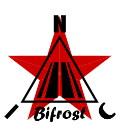

<p align="center">
  
</p>

★ N.I.C. ★

# Bifrost — the card between the head and the units

> **Design-stage concept — nothing built.** The figures are verified against the parts' sheets and
> the parts before a board is made.

**One card on an STM32H523: one port up to the Mayak, four ports down to the units, and the
absolute second put on every frame that passes.** Each of the Mayak's four trunk UARTs is a
point-to-point MasterNOD link to one card; the NodBus proper begins behind the cards. A card is the
master and the time authority of every spur it owns, and hands the head one homogeneous,
absolutely-timed stream. **There is no station without a Bifrost**: the Mayak has no spur port and
formats no second, so a station with one unit still has a card between the head and that unit.

**The card formats, it does not relay.** Each spur is its own bus with its own timing domain and
its own full cadence; the card re-slots what its units say onto the trunk, byte-identical, and
prepends the three high bytes of the second — so the Mayak allocates space in the file and writes,
with no time arithmetic at all. **Every record reaches the head exactly one second after it was
measured**: the card holds each unit's frames 96 frames in a circular buffer, the unit 32 before
it sends.

**One board, two roles.** The card pressed on Kronos's ribbon reads `ATTN` high and is a
**Bifrost**: it takes Kronos's 2²² and hands it to its ports undivided. Off the ribbon it reads `ATTN` low and is
an **Argus** (`argus/README.md`): it takes 2²² from its own up port and hands its four mini
segments 2¹⁹. One firmware; the level on one pin at boot is the whole difference.

```
          KRONOS ──the time bus: CLK 2²² · PPS_K · the label──┐
                                                               ▼
       ┌───────────┐                              ┌───────────────────────┐
       │   MAYAK   │══ the trunk, one per card ══▶│ THE CARD — H523       │══▶ port 1 ─┐
       └───────────┘   in-box crossed cable       │ 6 USARTs of 7:        │══▶ port 2  │ a data body and
                                                  │ 1 up + its echo,      │══▶ port 3  │ a power body each;
                                                  │ 4 down                │══▶ port 4 ─┘ Galvani boards
                                                  └───────────────────────┘              or an in-box cable
        up to four cards, one per trunk · at most eight units on any card
```

| | |
|---|---|
| ports | **one up, four down** — six USARTs of the H523's seven: the up port, its echo receiver, four down |
| units per card | **8**, whatever the port mix — the ceiling the trunk TDMA and the circular buffer are sized for |
| cards per station | up to **4**, one per head trunk — **16 units point-to-point, 32 in any mix**, the four beyond one a port coming from a multidrop copper segment |
| spur rung | **2²⁰** for a lone unit on its port, **2²¹** for two to eight on a chained copper segment, set at enrollment by the count (`../core/blocks/nodbus.md`) |
| what a port takes | any board of the Galvani family, or the crossed in-box cable; the card reads each body's `ID` before anything is fed |
| MCU | **STM32H523**, the house part and footprint — oversized on purpose: the scarce resources are UARTs, DMA channels and timer captures, and one part number across the station is worth the silicon |

**The card makes NodBus only.** A ModBus arm hangs off Palatine; any leaf bus a site needs hangs
off a unit behind a spur.

## The tree

```
bifrost/    Bifrost — the card, NodBus master: one link up, four spurs down  NodBus 2
└── argus/  Argus — the same card off Kronos's ribbon, NodBus mini master    NodBus 3
```

## Files

| file | contents |
|---|---|
| [`HARDWARE.md`](HARDWARE.md) | the card: the clock in and out, the pins, timers and clock tree, the sockets, the trunk, the supply, the frame's path, the ranging, the parts, the bench |
| [`FIRMWARE.md`](FIRMWARE.md) | the firmware, described: boot, `FLOOR`, the stamp, the circular buffer, the Argus layer, the control plane, the ladders, the registers |
| [`WHY.md`](WHY.md) | the graveyard: rejected alternatives and superseded states, with the reason |
| [`argus/`](argus/) | Argus — the same card in its other role: four NodBus mini segments for the small clocked units |

## Licence

Hardware: CERN-OHL-S v2 (`../LICENSE-HW`) · Software: MIT (`../LICENSE`) — Copyright (c) 2026 NIC — Native Intellect Community
