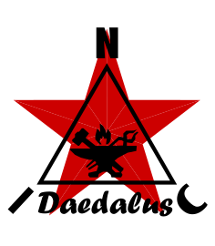

<p align="center">
  
</p>

★ N.I.C. ★

# Daedalus — the station as a structure

**English** · [Čeština](README.cs.md) · [Русский](README.ru.md)

> **Design-stage concept — nothing built.** The figures are verified against the parts' sheets and
> the parts before a board is made.

**Daedalus is the physical station**: the mast, the earth, the cable routing, the enclosure, the
vault and the finish — **everything a station has that is not a board and not a measurement.**
Named for the mythic engineer who built working machines — including wings — from what was at
hand, and the rule throughout is his: **classic, cheap, off-the-shelf, adapted by the builder.**

**It holds only what every station shares.** A seat, a sonde or a sensor tube belongs to the unit
that uses it, and a board belongs to its own project — nothing here names a board or a part.

## The block

```
   the mast — an isolated air termination where it must be the tallest thing          the antenna on an insulating bracket
        │                                                                             the coax to the enclosure
   ONE common earthing point ◀── every SPD common · the internal system's own bond, hard, no gap in it
        │
   the enclosure: the head, Kronos, the cards, the Galvani boards ══ cables in conduit, one trench ══▶ the units on their posts · the plate · the vault
```

## Files

| File | Contents |
|---|---|
| [`CONSTRUCTION.md`](CONSTRUCTION.md) | the build: the structures and what hangs on them, what the station is protected against, grounding, cable routing and the drawn cables, the enclosures, the head enclosure, the vault, the finish, service |
| [`WHY.md`](WHY.md) | the graveyard |
| [`drawings/`](drawings/) | mechanical drawings, filled as they are made |

## Licence

Hardware: CERN-OHL-S v2 (`../LICENSE-HW`) · Software: MIT (`../LICENSE`) — Copyright (c) 2026 NIC — Native Intellect Community
