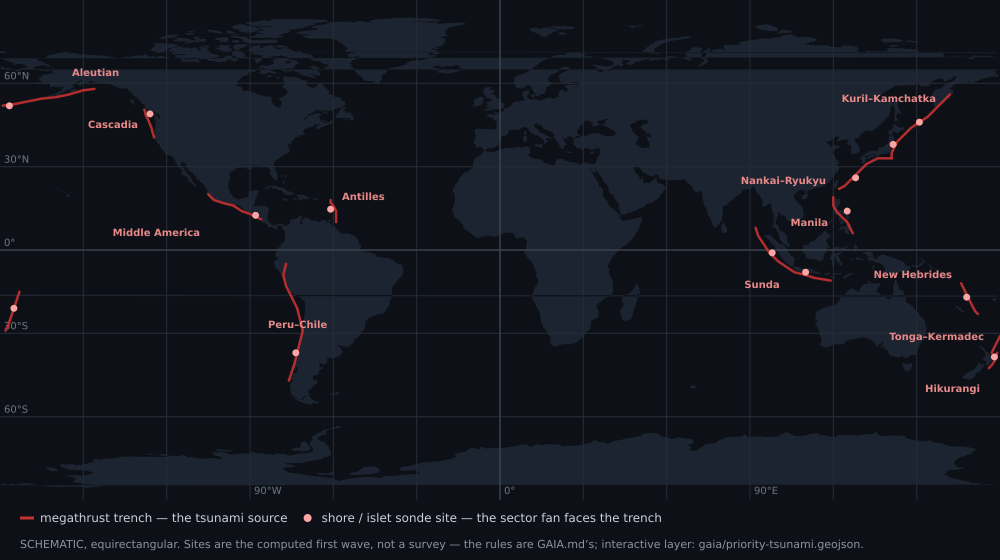

★ N.I.C. ★

# Gauss — the array: tsunami and ocean flow

> **Design-stage concept — Tier 2, the theory shelf.** The offshore array is a complete worked reference design, not a
> build target: submarine cables and deep hardware are government- or consortium-scale
> (`../gaia/SITING.md`, *The two tiers*). The pod it uses is the sea build (`CONSTRUCTION.md`).

> **The trench roster** — the megathrust sources and the shore and islet sites whose sector fans
> face them, from the siting rules in [`../gaia/SITING.md`](../gaia/SITING.md); the interactive layer
> is [`../gaia/priority-tsunami.geojson`](../gaia/priority-tsunami.geojson).

**On solid ground one quiet magnetometer is enough; moving seawater is the one case where many pay
off.** A crustal or magma change is so large a mass that its field barely differs over 100 m, so
dense spacing buys nothing. Moving seawater is spatially structured and it propagates.

## The physics

Seawater is conductive; moved through Earth's field it induces currents (**v × B**) that make a
secondary field. A tsunami moves the **whole water column in phase**, and that full-column
transport makes a **~1–2 nT, minutes-period signal that slightly leads the wave** (documented,
Tohoku 2011). Currents and storm surge do the same, weaker.

## Why one sonde cannot and an array can

One sonde sees ~1 nT against ~15–30 nT of its own noise and a geomagnetic background swinging tens
to hundreds of nT. But the background is **coherent over hundreds of km**, so on sondes 0,5–2 km
apart it is nearly identical: **common-mode rejection across the array** removes it and leaves the
local flow signal. √N takes the uncorrelated noise down, the tsunami's tens of minutes allow long
integration, and **the arrival moveout across the sondes gives the bearing and the speed**, which
also confirms a real propagating front.

**The enemy is the in-band geomagnetic variation**, not the white noise — Sq and the Pc
pulsations, tens of nT in the same mHz band — and only common-mode rejection removes it. One sonde
low-passed to the tsunami band is already down to ~1–1,5 nT; the array's rejection and √N do the
rest.

## Geometry — the ring

**Four, eight, twelve — and the ceiling is the laying.** The sondes stand in a ring round the
island at the toe of its slope:

| sondes | spacing | what a front from any bearing meets |
|---|---|---|
| **4** — the minimum | 90° | one sonde head-on and the two beside it on the flanks, partly; the lee one is the reference |
| **8** — the reconstruction | 45° | two or more head-on and the flanks either side — the bearing and the wrap round the island resolved |
| **12** — the ceiling | 30° | the same, with a sonde to lose |

**Twelve is set by the cable, not by the sensor.** Every sonde is a run of its own laid to the toe
of the slope, and the cable and its laying cost many times the sonde; past twelve a site buys
cable, not information.

The ring's common mode is what removes the background: the sondes are 0,5–2 km apart and see the
same geomagnetic variation, and the lee side sees none of the front.

## Where along the slope — the depth siting rule

The magnetometer sees **transport = velocity × depth**, so the signal tracks water depth. A linear
2-D shallow-water sweep past a circular island ([`models/`](models/), the script and the figure)
gives, normalised to deep water on the wave-facing side:

| where the sonde sits | transport signal |
|---|---|
| on the shelf, near shore | ~0,30× — most of the signal thrown away |
| up the slope | 0,4 → 0,97× |
| **the toe of the slope** | **~1,00×** |
| further out, the deep plain to the trench | 1,00× — no gain |

- **The optimum is the toe of the island's own slope, the nearest deep water.** Cable beyond it
  buys nothing; the knee (~85 %) sits just below the toe.
- **Do not creep onto the shelf to save cable** — it holds ~30 % of the signal.
- **The shape is universal, the distance is not.** On real ETOPO profiles across the network's 168
  sites the full-signal toe is at a **median ~120 km**; the 10–30 km of a steep volcanic flank fits a
  handful of islets. The honest deployment trades depth for cable: **the 100 km reach of the
  module reaches the full toe at 40 of the 121 measured sites and puts the median site at ~2,9 km of
  water, ≈ 80 % of the transport signal**; the shortfall is recovered by the array's rejection and
  long integration (`../gaia/bathy-per-site.csv`).
- **The flanks do slightly better** than the head-on sweep — the wave wraps round the island; the
  lee is dead.

The model is linear and frictionless: it fixes the depth-tracking shape and the toe optimum, not
the local run-up at a sharp break.

## Fusion at the gateway

**The common-mode rejection needs all sondes together, so the fusion runs at the cluster gateway,
not in the pods**, and only the reduced product goes up — a detection with bearing, speed and
amplitude, trivial for the uplink (`../core/UPLINK_TRANSPORT.md`). **The gateway is Tesla's H7A3
board**: offshore there is no lightning to watch, and a ring's twelve slow magnetometer streams at most are a fraction
of the sferic DSP the same part already carries. **A co-located Quake** gives the P-wave minutes
ahead of the magnetic signal: the seismograph warns, the magnetometers confirm and bear the wave.

**Transport per site**: the module that suits each run (`../galvani/README.md`). Per-arc cable lengths and sonde depths are in `../atlantis/README.md` (*the
cable & depth budget*).

**Scope.** Research-grade, detection not metrology, strongest at the toe of the slope. It is
**tsunami, ocean flow and geomagnetics — not earthquake prediction**: piezomagnetic precursors are
unconfirmed; the co-seismic and motional-induction signals are real.
