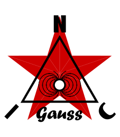

<p align="center">
  
</p>

★ N.I.C. ★

# Gauss — the magnetometer sonde

> **Design-stage concept — nothing built.** The figures are verified against the parts' sheets
> and the parts before a board is made.

**Gauss watches the slow magnetic field** — storms, sudden commencements, pulsations, dB/dt, and
under the sea the tsunami's motional-induction signal. It is a three-axis magneto-inductive
magnetometer (`RM3100`) with two thermometers and an H523 in a sealed tube, reporting the field's
**deviation from a stored baseline**. Tesla listens to the fast field, Gauss to the slow one — the
two units of the same quantity.

**It is fitted when no other sensor in the build carries a magnetometer.** Where a Quake carries
the chip, that is the station's magnetometer and no Gauss is built.

| | |
|---|---|
| class | **mini-NOD — NodBus mini type 1 `Gauss`**, behind an Argus; address `TYPE«4 \| NUMBER`, **0x11** for unit 1 |
| sensor | `RM3100` — three magneto-inductive coils, ~13 nT class, the resolution a layout and filtering result (`HARDWARE.md`) |
| thermometers | a `TMP117` on the tube wall — the ground or water temperature at depth, mK trend; an NTC between the coils — the drift regression's |
| MCU | `STM32H523`, LQFP100 — no crystal: the core runs on the HSI disciplined by the segment's rung |
| payload, 8 B | bytes **0–5** the three axes, `int16` deviation from the baseline; **6–7** reserve. The trigger is the **ALARM** flag in the header, the supply the **SUPPLY** flag |
| once a minute | the **`REPORT` frame** in the slot's fourth frame-time: `VBUS` · `CURRENT` · the wall `TMP117` · the coil NTC |
| body | a ~40 mm tube, **two builds**: land — PPR or HT pipe, one multi-stage gland, no connector, the caps fused; sea — PVDF pipe, oil or petroleum jelly, a glued gland at the bottom, to ~250 m (`CONSTRUCTION.md`); the deep build is Atlantis's |
| feed | 12 V from the unit power board at the pod end; the run 48 V or 300 V by its length, and the communication module that suits it — the family's pressure builds under water |
| draw | ~0,5–1 W by the communication module |

**The pod does no analysis.** It samples, corrects by its own calibration and temperature,
interpolates onto the frame grid and subtracts the baseline; spectra, long filters and array
fusion run above it.

## The block

```
   an ARGUS segment ══ the feed + the 2¹⁹ rung ══▶ ┌────────────────────────────────────────────────┐
   the unit power board and the communication      │ GAUSS — the Barrel pod, mini type 1            │
   board at the pod end                            │ Galvani boards │ H523 │ the gap │ RM3100 coils │ tip
                                                   └────────────────────────────────────────────────┘
   8 B a frame: the field; the wall TMP117 and the coil NTC once a minute
```

## Files

| File | Contents |
|---|---|
| [`HARDWARE.md`](HARDWARE.md) | the sensor board — the rails, the clock and its discipline, the pins, the sensor and the rules around it |
| [`CONSTRUCTION.md`](CONSTRUCTION.md) | the two builds — the land tube and the PVDF sea tube, the fill, where it stands, the calibration without rotating the site |
| [`ARRAY.md`](ARRAY.md) | the offshore array for tsunami and ocean flow — Tier 2, the theory shelf |
| [`FIRMWARE.md`](FIRMWARE.md) | the firmware, described — the poll, the `DRDY` stamp and the interpolation, the calibration and the baseline, the payload, the registers, what is tested |
| [`WHY.md`](WHY.md) | the graveyard |
| [`models/`](models/) | the shallow-water siting model behind `ARRAY.md`'s depth rule |

## Licence

Hardware: CERN-OHL-S v2 (`../LICENSE-HW`) · Software: MIT (`../LICENSE`) — Copyright (c) 2026 NIC — Native Intellect Community
