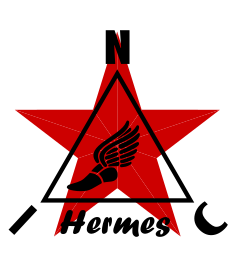

<p align="center">
  
</p>

★ N.I.C. ★

# Hermes — převodník BMS/MPPT

[English](README.md) · **Čeština** · [Русский](README.ru.md)

> **Koncept ve fázi návrhu — nic není postaveno.** Čísla se ověřují proti katalogovým listům a součástkám, než vznikne deska.

**Hermes je malá karta s H523 mezi LP I²C Mayaku a kupovanými napájecími deskami.** Dotazuje BMS
a MPPT po jakékoli sběrnici, se kterou přijdou, drží poslední sadu registrů a Mayak ji čte jako jeden
blok po LP I²C — smyčka přežití čte hotové hodnoty, místo aby čekala na dokončení cyklu sběrnice.
Hermes nic neměří; měření je práce BMS. **Spoj je vnitřní a nikdy se neodpojuje: právě jím se
centrála dozví, kdy se má vrátit.**

| | |
|---|---|
| třída | domácí karta, **bez typu sběrnice** — není uzlem NodBus ani podřízeným zařízením ModBus; periferie Mayaku na jeho napájecím konektoru |
| MCU | `STM32H523VE`, LQFP100, na 4 MHz z CSI nebo 8 MHz z HSI ÷ 8; bez krystalu; každá periferie, kterou nepoužívá, je vypnutá |
| směrem k centrále | **podřízené I²C** na **LP I²C** Mayaku, `ALERT` na LP GPIO, na **napájecím konektoru** Galvani, `ID` na **0,90** |
| směrem k napájecím deskám | **485 Modbus RTU na `THVD1450`**, standardní rozhraní · UART 3,3 V · výstup I²C přes `PCA9306` · CAN na `TCAN334` — osazena jsou všechna čtyři, nepoužitá spí; rozhraní nejsou izolovaná a kupované díly musí mít společný záporný pól (`HARDWARE.md`) |
| součástky | `STM32H523VE` · `THVD1450` · `TCAN334` · `PCA9306` · rezistor `ID` · čtyři dvoupólové bloky `DGPS2.5R-5.0` · dvě kolíkové lišty |
| napájecí vstup | **3,3 V z Mayaku přes konektor**, za vratnou pojistkou 0,15 A na Mayaku; žádná svorka 12 V, žádný snižující měnič |
| odběr | **≤ 100 mA na pinu 3,3 V** se všemi rozhraními osazenými a dotazujícími — to je rozpočet |
| firmware | jeden profil sdíleného enginu `nic-mod`, jediný profil se dvěma rozhraními: master směrem k BMS a MPPT, slave směrem k Mayaku (`FIRMWARE.md`) |

## Blok

```
   MAYAK ──LP I²C + ALERT─▶ HERMES ──485 Modbus RTU (THVD1450)──▶ the MPPT, or a BMS on 485
   (I²C master,  power      (H523,   ├─ UART 3,3 V TTL ───────────▶ a BMS on its own UART
    3,3 V out)   body        polls,  ├─ I²C out (PCA9306 for 5 V) ▶ a part that offers one
                             holds)  └─ CAN (TCAN334) ────────────▶ a part with no other bus

   Which units, and their protocols, are the build's: the card runs the MAP the builder fills
   for the units bought (FIRMWARE.md §5); the document names no vendor.
```

## Soubory

| soubor | obsah |
|---|---|
| [`HARDWARE.md`](HARDWARE.md) | deska — napájecí linka, takt, každý pin, rozhraní a jejich ochrana, konektor, součástky, kritéria zkoušek na stole |
| [`FIRMWARE.md`](FIRMWARE.md) | popis firmwaru — uspořádání a sběrnice, se kterými se akumulátor provozuje, mapa, kterou vyplní stavitel, průzkum sběrnice, blok, prahy a `ALERT`, co je otestováno |
| [`WHY.md`](WHY.md) | hřbitov |

## Licence

Hardware: CERN-OHL-S v2 (`../LICENSE-HW`) · Software: MIT (`../LICENSE`) — Copyright (c) 2026 NIC — Native Intellect Community
