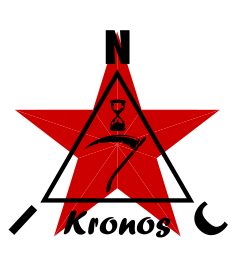

<p align="center">
  
</p>

★ N.I.C. ★

# Kronos — the station's clock

**English** · [Čeština](README.cs.md) · [Русский](README.ru.md)

> **Design-stage concept — nothing built.** The figures are verified against the parts' sheets and
> the parts before a board is made.

**A board of its own on an STM32H523, carrying the one precise part in the station: a 2²⁴ TCXO
disciplined to a received pulse.** Kronos takes PPS and NMEA from a GNSS receiver, or from Pip,
on two sockets. It steers its PLL to the pulse, subtracts the receiving chain's delay once, and
hands the station a clock and a named second on one time bus. Every other board counts that clock
and none keeps its own time.

```
   POLARIS or SPUTNIK ──NMEA + PPS, a data body──▶ ┌────────────────────────────┐
   PIP, where fitted  ──NMEA + PPS, a data body──▶ │ KRONOS — STM32H523         │
                                                   │ TCXO 2²⁴ · PLL1, FRACN     │
                                                   │ steered to the pulse       │
                                                   │ the delay table, once      │
                                                   └──────────────┬─────────────┘
                                                                  │ the time bus, one 10-pin ribbon:
                                                                  │ CLK 2²² · PPS_K on M-LVDS,
                                                                  │ the label on I²C, ATTN high
                                   ┌──────────────┬───────────────┼──────────────┬──────────────┐
                                   ▼              ▼               ▼              ▼              ▼
                                card 1         card 2          card 3         card 4        MAYAK
                               (ATTN high → a Bifrost)                                  the whole bus
```

**What it hands out.** `CLK` at 2²², the spur's own rate, and `PPS_K`, the derived second, both
divided from the one steered VCO, so a second is exactly 2²² clock periods and never steps. The **label** — the full
Unix second and the quality — goes on the time bus's I²C once a minute and on every change of
quality. The received pulse steers the loop and never leaves the board.

**What it takes.** A GNSS receiver of one of two named types, typed and never detected — `M8N` on
Polaris, which Kronos checks and configures at every boot, or `UM980` on a Sputnik — on the first
socket; Pip on the second.
With neither, the Mayak seeds a coarse second over the bus and the time is reported as seeded.
When the source goes, the TCXO carries the station — 1 ppm is 86 ms a day — and the quality says
holdover.

**What it contributes to the error: nanoseconds.** The station delivers ±1 µs; the capture grid
here is 7,45 ns and the delay table is subtracted on that grid.

**Where it stands.** In the enclosure, on the 12 V wire like every host, beside the Mayak and the
card row. It has no `ENABLE` above it; off is a Stop the Mayak commands, and the wake is an
address match on the time bus.

## The tree

```
kronos/         Kronos — the station's clock
└── polaris/    Polaris — its GNSS front, bought: a receiver and an antenna on a carrier
```

## Files

| file | contents |
|---|---|
| [`HARDWARE.md`](HARDWARE.md) | the board: the TCXO and the PLL, the time bus, the sockets, the processor's pins, timers and clock tree, the supply, the parts |
| [`FIRMWARE.md`](FIRMWARE.md) | the firmware, described: boot, the states, the sources, the discipline loop, PPS-K, the delay table, the label and the registers, faults, persistence, tests |
| [`WHY.md`](WHY.md) | the graveyard: rejected alternatives and superseded states, with the reason |
| [`polaris/`](polaris/) | Polaris — the time-only GNSS front a station fits on `TIME IN 1` when it has no Sputnik |

## Licence

Hardware: CERN-OHL-S v2 (`../LICENSE-HW`) · Software: MIT (`../LICENSE`) — Copyright (c) 2026 NIC — Native Intellect Community
