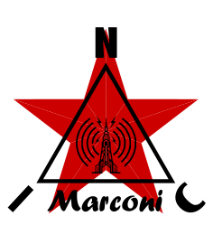

<p align="center">
  
</p>

★ N.I.C. ★

# Marconi — monitor ionosféry v pásmu KV, 0,5 až 16 MHz

[English](README.md) · **Čeština** · [Русский](README.ru.md)

> **Koncept ve fázi návrhu — nic není postaveno.** Čísla se ověřují proti katalogovým listům a součástkám, než vznikne deska.

**Marconi čte oblast F: NodBus typ 4, NOD.** Jednometrová vzduchová smyčka, transimpedanční vstupní
obvod a 16bitový převodník, který vzorkuje celé pásmo 0,5–16 MHz najednou, čtený procesorem
STM32H7A3, který signál transformuje přímo na desce.

**Co měří:**

- **úroveň pevných vysílačů KV v čase** — časové stanice, kanálové značky, NAVTEX, majáky — nalezených
  rozmítáním na pozadí a čtených každých 10–30 s, každý jako jedna logaritmická úroveň; denní
  a noční dvojice značek dávají útlum v závislosti na frekvenci na jedné dráze a denní otevírání
  a zavírání pásma je samo o sobě měřením;
- **pasivní ionogram** — chirpové sondy zachycené při rozmítání pásma, na uzlu vyhodnocené na
  `foF2`, `h'F` a `MUF(3000)`.

| jednotka | vrstva | jak |
|---|---|---|
| **Pip** | **oblast D** | úrovně nosných VLF/LF — náhlé ionosférické poruchy |
| **Marconi** | **oblast F** | úrovně nosných KV, 0,5–16 MHz — MUF / `foF2`, pasivní ionogram |
| **Sputnik** | integrovaný sloupec | dvoufrekvenční TEC z GNSS |

Pojmenován po transatlantickém přenosu z roku 1901, který fungoval díky vrstvě, kterou tato deska
měří — Kennellyho–Heavisideova vrstva byla navržena o rok později, aby ho vysvětlila.

## Jak je připojen ke stanici

**Marconi je sám na vlastní odbočce Bifrostu — bod–bod, plný duplex, konec trasy na straně
jednotky.** Napájecí deska pro jeho napájení a komunikační deska pro jeho médium se zasouvají do jeho
zásuvek; trasa na jeho vlastní desce nic nemění. Hodiny jsou Kronosovy, na hodinovém páru odbočky,
a deska k nim zavěsí své jádro, kódovací takt převodníku i každý vzorek. **Jeden slot**: hrstka
nosných po 4 B a tři parametry ionogramu. 134 MB/s zůstává uvnitř krabice; na vodič jde jen několik
bajtů za sekundu.

**Smyčka stojí na stožáru s rovinou vypočtenou ze souřadnic vysílačů** a deska sedí v krabici
u jejího napájecího bodu. Ze všech jednotek stanice je nejvíce vystavená úderu blesku a obětuje se
jako první.

```
   the loop, 1 m ──▶ LMH5401 ─ RC chain ─ THS4541 ──▶ AD9265-80, 2²⁶ SPS ──PSSI──▶ ┌──────────────────────────┐ ── NodBus spur, type 4 ──▶ BIFROST
                                                                                   │ MARCONI — STM32H7A3      │
                                                         APS25608N PSRAM ◀─OCTOSPI─│ burst · FFT · sweep ·    │
                                                                                   │ chirp scaler             │
                                                                                   └──────────────────────────┘
```

## Soubory

| soubor | obsah |
|---|---|
| [`BAND.md`](BAND.md) | proč 0,5–16 MHz, cíle, interval opakovaného měření, proč jeden kanál pokryje celý rozsah, test produktu |
| [`HARDWARE.md`](HARDWARE.md) | deska — smyčka jako zdroj, přepětí, přímé vzorkování a RC řetězec, vstupní obvod s hodnotami součástek, řetězec hodin, PSSI, součástky a napájecí linky, dávka, piny procesoru, rozhraní ke stanici |
| [`CONSTRUCTION.md`](CONSTRUCTION.md) | orientace a stavba smyčky, uzavřený prstenec, montáž, která ponechává ostrov plovoucí |
| [`BUS.md`](BUS.md) | záznamy nosných a ionogramu |
| [`FIRMWARE.md`](FIRMWARE.md) | popis firmwaru — dávka, transformace, nosné a rozmítání, chirp a vyhodnocovač, registry, co je otestováno |
| [`models/`](models/) | `pointing.py` — orientace smyčky ze souřadnic stanice, nástroj za tabulkou v `CONSTRUCTION.md` |
| [`WHY.md`](WHY.md) | hřbitov — zamítnuté alternativy a překonané stavy |

## Licence

Hardware: CERN-OHL-S v2 (`../LICENSE-HW`) · Software: MIT (`../LICENSE`) — Copyright (c) 2026 NIC — Native Intellect Community
