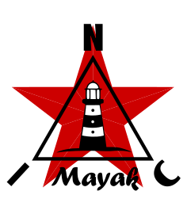

<p align="center">
  
</p>

★ N.I.C. ★

# Mayak — the station's head

> **Design-stage concept — nothing built.** The figures are verified against the parts' sheets
> and the parts before a board is made.

**Mayak records the station and is its one door to the world.** One board on an ESP32-S31: it brings
the cards' floors up, receives the finished, stamped records they hand it, closes each second, keeps
of each unit what its recording rule selects and writes it to two microSD cards as HMC, a series of
files per unit, holds the station's configuration mirror, and sends the data home — Wi-Fi for the
archive, the modem for the thin values frame, BLE for the phone at the open box. **It interprets no
front's payload**: a seismic sample and a GNSS chunk are bytes under a TYPE, kept or dropped by a
rule that compares bytes, and the server reads them. It reads the pack through Hermes once a minute
and is the one thing in the station that puts the units down in order before a deficit takes them.

## How it hangs on the station

- **Down: four trunks, one card each.** Point-to-point MasterNOD links at 2²¹, plain UART levels on
  a crossed in-box cable; the NodBus proper starts behind the cards. The head speaks three verbs to
  a card — bring your floor up, power a port, clock a port — and then listens. An unfitted pad for
  a 330 Ω pull-up on each trunk `RXD` is the whole hardware provision for a second card on one
  port, which the firmware does not implement and no board fits.
- **Time: a tap on Kronos's ribbon.** The head's time is the `PPS_K` edge, captured in hardware,
  and the label on the time bus's I²C; the clock pair is received and unused. The head stamps
  nothing that reaches the archive — every record carries the card's second.
- **Power: Hermes on the LP I²C**, the converter to the BMS and the MPPT, never gated; the LP core
  alone reads it in survival. A backup cell carries the head through a loss of the 12 V long
  enough to write every buffer and report the cause.
- **Out: Wi-Fi, the modem position, BLE and USB.** The values frame once an hour and on a marker; the archive
  over Wi-Fi where the site has it; the phone in a button-gated window; the USB console in every
  state, and the power for a dead station's head.

```
   KRONOS ──PPS-K + the label──▶ ┌──────────────────────────────┐ ──trunk 1..4, 48 B MasterNOD, point-to-point──▶ the BIFROST / ARGUS cards
                                 │ MAYAK — ESP32-S31            │
   HERMES ◀──LP I²C + ALERT──────│ the store · the mirror ·     │ ──▶ modem · Wi-Fi · BLE · USB
                                 │ the uplink                   │
                                 └──────────────────────────────┘
```

## The tree

```
mayak/        Mayak — the head: datalogger and uplink  NodBus 1
└── handset/  Handset — the commissioning app, over BLE
```

## Files

| file | contents |
|---|---|
| [`HARDWARE.md`](HARDWARE.md) | the board — the S31 module, the connectors and every pin, the trunk as a spur, the time bus tap, the serial and DMA budget, the 12 V input, the rail, the backup cell, the USB service supply, the parts, the bench |
| [`FIRMWARE.md`](FIRMWARE.md) | the firmware, described — the trunks, time on the head, ingest and the archive, the tree, the numbers and the configuration mirror, the control plane, the uplink, the service window, power and survival, event assessment, what is tested |
| [`WHY.md`](WHY.md) | the graveyard — rejected alternatives and superseded states |
| [`handset/`](handset/) | the phone app, described, and the GATT contract it keeps with the head |

## Licence

Hardware: CERN-OHL-S v2 (`../LICENSE-HW`) · Software: MIT (`../LICENSE`) — Copyright (c) 2026 NIC — Native Intellect Community
