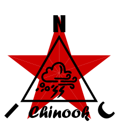

<p align="center">
  
</p>

★ N.I.C. ★

# Chinook — z čeho se skládá vzduch

[English](README.md) · **Čeština** · [Русский](README.ru.md)

> **Koncept ve fázi návrhu — nic není postaveno.** Čísla se ověřují proti katalogovým listům a součástkám, než vznikne deska.

**Chinook je sada Palatine pro složení vzduchu, ne deska a ne jednotka.** Každé čidlo vzduchu, které
stojí za osazení, je kupovaná jednotka RS-485 ModBus na větvi ModBus (arm) Palatine, slave na adrese,
která se do ní zapíše jako u každého kupovaného čidla (`../HARDWARE.md`, *The Modbus address map*),
a Palatine ji čte stejně jako svá ostatní čidla (`../`, `../../core/blocks/modbus.md`). Nic se
nevyrábí, nic se neregistruje na NodBus a nic se nepřidává do protokolu.

**Palatine měří počasí, Chinook to, z čeho se skládá vzduch.** Teplota, vlhkost, tlak, vítr, záření,
UV, srážky, sníh, půda a ovlhčení listů patří Palatine. Zbývá **chemie vzduchu a prachové částice** —
veličiny, které si lokalita osadí z vlastního důvodu, ve vlastním prostředí a za vlastní rozpočet.

## Základní výbava neosazuje nic

**Stanice neměří žádnou chemii vzduchu, pokud si ji lokalita nevyžádá, a důvodem jsou peníze.** Každá
jednotka pro chemii vzduchu je spotřební materiál nebo servisní položka:

| třída | co se opotřebovává | životnost |
|---|---|---|
| elektrochemický článek — CO, NO₂, O₃, SO₂, H₂S, NH₃ | článek, který spotřebovává svůj cílový plyn | ½–2 roky |
| MOX — index VOC nebo NOx | vyhřívaný prvek driftuje; index si znovu nastavuje základní úroveň, absolutní hodnota nikdy nevydrží | 1–2 roky použitelného indexu |
| laserový čítač částic — PM | ventilátor a otevřená optická komora, která se zanáší prachem, jejž počítá, v mlze se v ní sráží vlhkost a chytá se do ní hmyz | venku jedna sezóna mezi čištěními |
| NDIR — CO₂, CH₄ | nic: uzavřená optická dráha, žádná pohyblivá část | osadit a nechat být |

Jedna jednotka stojí kolem sta dolarů a vydrží pár let; pět na stanici znamená pár set dolarů ročně
a jednu návštěvu; sto stanic znamená trvalý rozpočet a servisní objížďku — za veličiny, které ve
volné krajině většinou měří právě tu krajinu. **Proto základní výbava nenese nic z toho.** Lokalita,
která chemii vzduchu chce, si jednotky koupí, rozpočítá jejich výměnu a čištění a pověsí je na
větev; `SENSORS.md` říká, co koupit podle prostředí a co musí každá splňovat.

## Co stanice dává vzduchové jednotce

- **Větev Palatine**: 12 V z větve (kupovaná součástka snese 10–30 V), jedna přenosová rychlost na
  větev, 9 600 nebo 19 200, a položku v soupisu s rozsahem registrů jednotky; kupovaná jednotka se
  ověřuje tím, že odpoví.
- **Hodiny stanice u každého čtení**, takže tam, kde je osazena Tesla, sedí nárůst CO na stejné
  sekundě jako úder blesku, který ho způsobil.
- **Spínání napájení po jednotkách** na napájecí desce větve mezi čteními, kde to součástka snese —
  vyhřívaná jednotka nebo jednotka s ventilátorem a optikou to snést nemusí.
- **Nic dalšího**: žádná korekce na uzlu, žádná deska pro vzduch, žádná vyhřívaná komora v základní
  výbavě.

## Blokové schéma

```
   PALATINE ──a ModBus arm──▶ bought RS-485 ModBus units, each at its written address:
                               particulates · CO · CH₄ · NO₂ · O₃ · SO₂ · H₂S · NH₃ · CO₂ · VOC — per site, none in the base
```

## Soubory

| soubor | obsah |
|---|---|
| [`SENSORS.md`](SENSORS.md) | co koupit podle prostředí a co musí vzduchová jednotka splňovat — čítač částic, třídy chemických čidel, teplota, vlhkost |
| [`CONSTRUCTION.md`](CONSTRUCTION.md) | kryt — komín, síťka a přepážka, vstup čítače, kde stojí, sestava pro chladné klima |
| [`WHY.md`](WHY.md) | hřbitov — co se zkusilo, co padlo a proč |

## Licence

Hardware: CERN-OHL-S v2 (`../../LICENSE-HW`) · Software: MIT (`../../LICENSE`) — Copyright (c) 2026 NIC — Native Intellect Community
