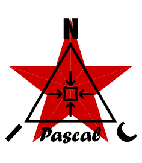

<p align="center">
  
</p>

★ N.I.C. ★

# Pascal — the pressure sonde

**English** · [Čeština](README.cs.md) · [Русский](README.ru.md)

> **Design-stage concept — nothing built.** The figures are verified against the parts' sheets
> and the parts before a board is made.

**Pascal reads the water column above it from the sea floor: NodBus mini type 3, a mini-NOD on an
Argus segment.** It is the Tier 1 tsunami gauge — where a coastal site cannot keep a radar mast,
Pascal measures the same wave from underneath (`../atlantis/README.md`). Its address is the
computed one, `TYPE«4 | NUMBER`, **0x31** for unit 1; it ships 4 B of pressure a frame, the
wave-period mean, and its temperatures and the arrived feed once a minute (`FIRMWARE.md`).

**The body is Gauss's sea build with one hole in it**: a PVDF tube, a glued gland at the bottom, a
water-blocked cable, filled with oil or petroleum jelly, no bladder (`../gauss/CONSTRUCTION.md`),
and through its wall the depth gauge in its `Bar30` housing, whose gel face is the face in the water.
The fill protects the electronics and never enters the measurement. A static offset is harmless —
Pascal measures a *change*, never an absolute depth; creep and thermal drift sit in hours, the wave
in minutes (`HARDWARE.md`, *What it measures*).

| | |
|---|---|
| MCU | `STM32H523VE`, LQFP100 — no crystal, the core on the HSI disciplined by the segment's rung (`HARDWARE.md`, *The rung disciplines the core*) |
| the sensor | **TE Connectivity `MS5837-30BA`**, order code `MS583730BA01-50` — a 30 bar ≈ 300 m piezoresistive gauge, I²C — **in a Blue Robotics `Bar30` housing**: an M10 threaded penetrator with the gauge's gel face in the water, through the tube wall |
| resolution | **0,2 mbar** RMS at the highest oversampling ≈ 2 mm of water |
| absolute accuracy, 0–40 °C | ±50 mbar (0–6 bar) · ±100 mbar (0–20 bar) · **±200 mbar (0–30 bar)** — at the ~21 bar working depth the part sits in the ±2 m class, and the measurement is a change |
| thermometer | a **`TMP117` on the tube wall**, in the oil — the bottom-water temperature, 0,1 °C absolute, mK trend; the gauge's own temperature stays its compensation |
| the parts | `STM32H523VE` · the depth gauge · `TMP117` · `LMR43610` |
| bus | **NodBus mini** — one Galvani data body and one power body, a segment behind an Argus; mini carries the clock, which is why the sonde is on it |
| boards | a power board and a communication board in the family's pressure build — solid parts only, no air cavity, potted into the oil with the rest; the module that suits the run (`../galvani/README.md`, *Pressure boards and land boards*) |

## Where it sits

**150–200 m of water**: deep enough to be under the surface world, shallow enough to sit close in
on a steep island flank. At 200 m a tsunami is roughly **20 cm ≈ 20 mbar** (Green's law from
~10 cm in the deep ocean) and travels at √(g·h) ≈ **44 m/s**. The sondes stand in a ring of 4, 8
or 12 round the island, as Gauss's do — the ring and its ceiling are `../gauss/ARRAY.md`. The pod is anchored to a footing and its cable clamped to it, because a
pod that rises 10 cm reports 10 mbar that never happened (`CONSTRUCTION.md`).

**Depth kills the wind sea and leaves the long swell**, and the swell is the size of the tsunami
itself; what separates them is the band, seconds against minutes, so Pascal burst-samples and
averages over the wave period (`HARDWARE.md`, *What it measures*).

## The block

```
   an ARGUS segment ══ the feed + the 2¹⁹ rung ══════▶ ┌───────────────────────────────────────────┐
   the family's pressure boards, feed and medium       │ PASCAL — the oil-filled tube, mini type 3 │
                                                       │ H523 · LMR43610 · the depth gauge through │  pressure, 4 B a frame · the temperatures
                                                       │ the wall · TMP117 on the wall             │  and the feed once a minute in the REPORT frame
                                                       └───────────────────────────────────────────┘
```

## Files

| file | contents |
|---|---|
| [`HARDWARE.md`](HARDWARE.md) | the board — what it measures and how, the rail, the clock and its discipline, every pin, the bodies, the parts, the bench criteria |
| [`CONSTRUCTION.md`](CONSTRUCTION.md) | what Pascal adds to Gauss's sea build — the hole and the sensor body, the footing, the cable |
| [`FIRMWARE.md`](FIRMWARE.md) | the firmware, described — the conversion train, the wave-period mean, the alarm, the payload, the registers, what is tested |
| [`WHY.md`](WHY.md) | the graveyard |

## Licence

Hardware: CERN-OHL-S v2 (`../LICENSE-HW`) · Software: MIT (`../LICENSE`) — Copyright (c) 2026 NIC — Native Intellect Community
