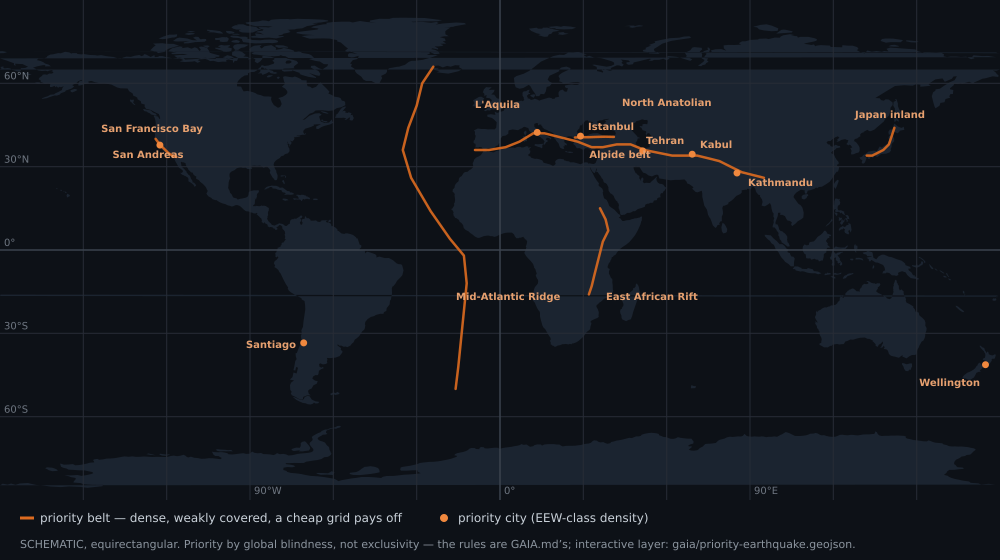

<p align="center">
  
</p>

★ N.I.C. ★

# Quake — the seismograph

**English** · [Čeština](README.cs.md) · [Русский](README.ru.md)

> **Design-stage concept — nothing built.** The figures are verified against the parts' sheets
> and the parts before a node is made.

**Quake is the station's seismograph: NodBus type 5, a NOD.** A sealed tube seated in a hole in
rock or soil, left alone for years. It measures ground acceleration on two accelerometers at
different ranges, rotation on a gyro, tilt and drift on an inclinometer, and — by population —
the magnetic field and the temperature of the ground at depth. 128 samples a second, 40 B a
frame, levelled on the node.

**MEMS, not geophones.** A MEMS proof mass resonates in the kHz range, far above the seismic band
below 20 Hz; the part is sealed on one die, calibrated at the factory, digital, three axes in one
package — one chip where a geophone build takes three coils.

## What one node sees

**A strong-motion and local-event instrument, not an observatory seismometer.** The MEMS noise
floor — ~25 µg/√Hz on the precise part — sits well above a geophone's, so one node catches:

- felt local quakes, roughly **M ≥ 3 within ~50 km**;
- larger regional events, roughly **M ≥ 4,5 out to a few hundred km**;
- not the small distant event a geophone would — an M3 at 150 km is under the floor.

**The network is the instrument**: many nodes on a dense grid recover what one cannot, and the
shared hardware clock aligns them to **±1 µs** where a hobby seismograph on NTP holds ±10 ms —
which is what makes arrival-time and cross-node work possible.

## How it hangs on the station

**Every Quake is alone on its own Bifrost spur — point-to-point, full duplex, the unit end of the
run.** The node carries no line part: a power board for its feed and a communication board for its
medium sit in the tube at the cable end, and the run — copper or glass, 48 V or 300 V — changes
nothing on the Quake's own board. The clock is Kronos's, carried on the spur's clock pair; the node
locks to it, clocks its sensors from it, and fires its frame in its slot. **Installed at any angle
within ~10° of vertical**: one calibration command and the node levels itself from the gravity
vector.

```
   a Bifrost spur ══ the feed + the data pairs ══▶ power board + communication board ──┐
                                                                                       │ NB IN · PWR IN · 12V
                                                        ┌──────────────────────────────┴──────┐
                                                        │ QUAKE — H523, type 5, 40 B a frame  │
                                                        │ ADXL355 · ICM-42688-P · SCL3300     │
                                                        │ RM3100 and TMP117 by population     │
                                                        │ an NTC between the coils            │
                                                        └─────────────────────────────────────┘
```



> **Where the grid pays off** — the priority belts and cities, from the siting rules in
> [`../gaia/SITING.md`](../gaia/SITING.md); the layer is
> [`../gaia/priority-earthquake.geojson`](../gaia/priority-earthquake.geojson).

## Files

| file | contents |
|---|---|
| [`HARDWARE.md`](HARDWARE.md) | the board — sensors, supply, the processor's pins, timers and clock tree, the bodies, the parts |
| [`FIRMWARE.md`](FIRMWARE.md) | the firmware, described — boot, the bus, time, acquisition, calibration, registers, faults |
| [`BUS.md`](BUS.md) | the payload, the 16-bit wire format, the report frame, storage |
| [`CONSTRUCTION.md`](CONSTRUCTION.md) | the seat in the ground, the Barrel family and its bending modes, depth, the cable |
| [`WHY.md`](WHY.md) | the graveyard — rejected alternatives and superseded states |

## Licence

Hardware: CERN-OHL-S v2 (`../LICENSE-HW`) · Software: MIT (`../LICENSE`) — Copyright (c) 2026 NIC — Native Intellect Community
