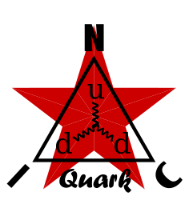

<p align="center">
  
</p>

★ N.I.C. ★

# Quark — the radiation part

> **Design-stage concept — nothing built.** The figures are verified against the parts' sheets and
> the parts before a board is made.

> **Quark is the station's radiation part: what it measures, and the two builds that measure it.**
> Photons, beta and neutrons, read **two ways that do not share a part**:
>
> - **[Quark-Tubes](tubes/)** — **high voltage.** GM and proportional tubes, every one counted on
>   one H523 board, **the unit `Quark-Tubes`, NodBus mini type 2**, counts only. The tube heads —
>   Photon's GM tubes, Helion, Gadolin/Rhodion — carry no MCU.
> - **[Quark-Scintillation](scintillation/)** — **low voltage.** Scintillators read by electronics
>   on two H7A3 boards, `Quark-Photon` and `Quark-Neutron/Positron`: **the NODs Photon (type 9) and
>   Positron (type 11)**, with `Neutron` a channel of the second, counts and energy.
>
> **`Quark` alone is this folder and the part as a whole — never a unit and never a board.** Every
> board carries the family's prefix, so its build is read off its name. Photon stands in both
> builds: the GM tubes behind graded lead on Quark-Tubes, the crystal on Quark-Scintillation —
> one quantity, measured both ways.

| unit | quantity | Quark-Tubes — high voltage | Quark-Scintillation — low voltage |
|---|---|---|---|
| **Photon** | γ + X-ray | three GM tubes, K1 bare · K2 β-stopped · K3 behind Pb ([`tubes/HEADS.md`](tubes/HEADS.md)) | CsI(Tl) + SiPM + PIN on `Quark-Photon`, type 9 ([`scintillation/photon/`](scintillation/photon/)) |
| **Positron** | β, both signs | K1 − K2, the bare tube over the plate | the 25 mm plastic block + SiPM on `Quark-Neutron/Positron`, type 11 ([`scintillation/positron/`](scintillation/positron/)) |
| **Helion · Neutron** | neutron | Helion, the He³ / BF₃ proportional tube on K4 ([`tubes/helion/`](tubes/helion/)) | the two-screen stack (`⁶LiF/ZnS(Ag)` · PMMA · a thin second `⁶LiF/ZnS(Ag)`) read by a photomultiplier, channel 1 of the same board, two counts in Positron's record — `Neutron` ([`scintillation/neutron/`](scintillation/neutron/)) |
| **Gadolin / Rhodion** | neutron | thirteen SI-22G tubes around a Gd or Rh converter, merged on K4 ([`tubes/gadolin/`](tubes/gadolin/)) | — |

The neutron physics every neutron head stands on is [`NEUTRONS.md`](NEUTRONS.md). Together the units are a *citizen-science* relative
monitor — not calibrated dosimetry — whose value is a **dense, cheap, clock-synced grid** that
correlates radiation bursts with specific lightning strikes (TGF) across the network.

## Two builds, and the units they serve

**The radiation units are named by quantity — Photon (γ), Neutron and Helion (n), Positron (β) — and the
technology is a build.** The tube side is **Quark-Tubes**: one assembly, one mini-NOD, counting
every tube. The scintillation side, **Quark-Scintillation**, is **two classic NODs on the NodBus — Photon type 9 and Positron
type 11, the two neutron counts four bytes of Positron's record; type 10 reserved for `Neutron`** — standing on **two** boards whose physics and front end are
[`scintillation/photon/SCINTILLATION.md`](scintillation/photon/SCINTILLATION.md).

| | **Quark-Tubes — mini-NOD type 2** | **Quark-Scintillation — Photon and Positron, NodBus 9 and 11** |
|---|---|---|
| detects by | gas ionisation, counted as pulses | scintillation light, digitised as a waveform |
| heads | GM behind graded Pb (Photon's tube build) · He³ / BF₃ (Helion) · Gadolin/Rhodion | CsI(Tl)+SiPM+PIN (γ) · 25 mm plastic block+SiPM (β) · two-screen stack + photomultiplier (n, `Neutron`, `scintillation/neutron/HARDWARE.md`) |
| high voltage | **yes** — ~400 V for GM, 1300–1600 V for the He³ tube on a 1300–2000 V source | **nothing above ~30 V on the SiPMs and the PIN**; `Neutron`'s photomultiplier on the kV source, ~1,2 kV (`tubes/helion/HARDWARE.md`) |
| MCU | **STM32H523** | **STM32H7A3IIT6**, the ordinary **−40…+85 °C** grade — and it is the **converter**, not the compute or the memory, that asks for it |
| converter | none — pulses land on timer inputs and EXTI | **`AD9251-80`** — dual 14-bit, 80 Msps, interleaved on the PSSI: **88,080384 MHz on the pins, 21 × 2²¹ = 44,040192 MSPS a channel** |
| yields | **counts** — four derived channels: beta · soft γ · hard γ · neutron | **counts and energy** — the pulse area is the deposited energy, so a real dose follows |
| payload | the 8 B mini payload: 4× `uint16`, **accumulators reset on the second boundary** ([`tubes/BUS.md`](tubes/BUS.md)) | the one 32 B scintillation record every frame — count · energy sum · largest event · 12 energy bands on Photon, 10 and the two neutron counts on Positron, no flags — every field an accumulator reset on the second ([`scintillation/photon/BUS.md`](scintillation/photon/BUS.md)) |
| cost | low | high; the crystal assembly is ~60 % of a head's BOM |

**The spectrum stays local either way** — the scintillation units compute their histograms on the
board and ship the record (count · energy sum · largest event · the bands, every frame — the mean,
the median and the dose follow from the sum downstream), or, switched by a register, the list of particle energies for
calibration and research; the histogram leaves rarely or on request (`scintillation/photon/BUS.md`).

**The clock arrives with the bus either way.** Quark-Tubes, a mini-NOD, captures its segment's rung on
a **timer, not on HSE** (`../core/blocks/nodbus.md`). The scintillation NODs stand behind a
Bifrost and take the wire clock like any node; the encode is **21 × 2²¹**, an integer PLL off that
same wire clock, so the converter runs on the station's own clock tree and there is no oscillator
and no fractional divider on the board.

## Why the network — TGF attribution

This is the reason the cheap grid exists. Because every node shares the one network clock, a
strike (lightning node) and the gamma/neutron counts (this node) carry the **same frame
stamp**. The network then **TOA-locates** each strike — a microsecond is 300 m — and
**amplitude-correlates** the burst — a weak strike makes no hard gamma, a strong one does
— so a TGF in a multi-strike frame is **attributed to the strong strike**, and the wide
network pins *which* one. Full mechanics in
[`../tesla/DETECTION.md`](../tesla/DETECTION.md), *TGF correlation*.

## Safety

**A detector, not a source** — no fissile or regulated material, no neutron source; it does not
emit. Calibration against Am-Be or Cf-252 is optional and is an institution's, never a workshop's.

- **High voltage** — ~400 V on the GM tubes, 1300–1600 V on the He³ tube from a source tapped to
  2000 V, up to 2400 V corona: lethal in every case. Insulation, a discharge path (the capacitors
  hold their charge after power-off), a closed enclosure, no exposed terminal; above ~2 kV creepage
  and potted joints.
- **Beryllium is never machined** — its dust causes berylliosis, sensitisation years later, at
  µg/m³. Graphite is the reflector; beryllium only as a sealed finished part, if ever.
- **Lead** — wound from foil, never melted indoors; hands washed, kept from food.
- **Gd₂O₃ powder** — low toxicity, but not inhaled while mixing; bound in wax or polyethylene it is
  safe.
- **Activation foils** — weakly and briefly active after exposure (seconds to minutes, manganese
  hours); the metals themselves are inert.
- **Gases** — He³ is inert; **BF₃ is highly toxic**, which is why a solid B-10 layer is preferred to a
  BF₃ fill.

## The block

```
   QUARK-TUBES — HIGH VOLTAGE
   K1 · K2 · K3 GM tubes ───────────┐
   the He³ tube, or the Gd/Rh ring ─┴──▶ QUARK-TUBES (H523) ──▶ mini type 2
   one 400 V module for every GM tube; the kV source for the tube

   QUARK-SCINTILLATION — LOW VOLTAGE
   CsI(Tl) + SiPM + PIN ─────────────────────────▶ QUARK-PHOTON (H7A3 · AD9251) ──▶ Photon, type 9
   the plastic block + SiPM ─────────────────────┐
   the two-screen stack + the photomultiplier ───┴──▶ QUARK-NEUTRON/POSITRON ──▶ Positron, type 11
```

## The tree

```
quark/                Quark — the radiation part
├── NEUTRONS.md       the neutron physics both builds share
├── tubes/            Quark-Tubes — high voltage, counts only                       mini 2
│   ├── HEADS.md      Photon — the GM tubes K1–K3 behind graded lead
│   ├── helion/       Helion — the He³ / BF₃ tube on K4, and the kV source
│   └── gadolin/      Gadolin — the Gd ring on K4, with Rhodion
└── scintillation/    Quark-Scintillation — low voltage, counts and energy
    ├── photon/       Photon — CsI(Tl) + SiPM + PIN, on Quark-Photon                NodBus 9
    ├── positron/     Positron — plastic block + SiPM, on Quark-Neutron/Positron    NodBus 11
    └── neutron/      Neutron — ⁶LiF/ZnS(Ag) + photomultiplier, on the same board   type 10 reserved
```

## Files

| Folder / file | Contents |
|---|---|
| [`tubes/`](tubes/) | **Quark-Tubes, high voltage** — the unit and its one board (mini type 2), the GM head, the He³ head, the Gadolin/Rhodion ring |
| [`scintillation/`](scintillation/) | **Quark-Scintillation, low voltage** — the group: Photon, Positron, Neutron |
| [`scintillation/photon/`](scintillation/photon/) | Quark-Scintillation — the gamma unit, `Quark-Photon`; also the H7A3 layer both LV boards share, the scintillation physics, the record contract and the one firmware image |
| [`scintillation/positron/`](scintillation/positron/) | Quark-Scintillation — the beta unit on `Quark-Neutron/Positron` |
| [`scintillation/neutron/`](scintillation/neutron/) | Quark-Scintillation — `Neutron`, the photomultiplier channel on the Positron board, type 10 reserved |
| [`tubes/helion/`](tubes/helion/) | Quark-Tubes — Helion, the He³ / BF₃ tube, and the kV source |
| [`tubes/gadolin/`](tubes/gadolin/) | Quark-Tubes — Gadolin and Rhodion, the thirteen-tube ring on K4 |
| [`WHY.md`](WHY.md) | the graveyard |
| [`NEUTRONS.md`](NEUTRONS.md) | the neutron physics the three neutron heads share — the families, the efficiency chain, the short-range rule, cross-sections, activation targets, tubes by fill and where to buy them |

## Licence

Hardware: CERN-OHL-S v2 (`../LICENSE-HW`) · Software: MIT (`../LICENSE`) — Copyright (c) 2026 NIC — Native Intellect Community
