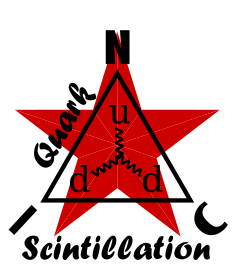

<p align="center">
  
</p>

★ N.I.C. ★

# Quark-Scintillation — nízkonapěťové radiační jednotky

[English](README.md) · **Čeština** · [Русский](README.ru.md)

> **Koncept ve fázi návrhu — nic není postaveno.** **Nízkonapěťová sestava Quarku**, radiační části ([`../README.md`](../README.md)); vysokonapěťová sestava je [`Quark-Tubes`](../tubes/). Tento soubor je mapou skupiny: co v ní stojí a kde je co popsáno.

**Scintilátory čtené elektronikou, na dvou deskách.** Krystal, plastový blok nebo stínítko promění částici v záblesk světla; SiPM, PIN dioda nebo fotonásobič promění světlo v impulz; deska impulz digitalizuje jako průběh a jeho plocha je deponovaná energie. Tato strana tedy dává **počty a energii**, zatímco trubice dávají počty. Nic na ní neběží nad ~30 V kromě fotonásobiče `Neutron`.

| jednotka | veličina | snímací část | deska | na sběrnici |
|---|---|---|---|---|
| **[Photon](photon/)** | γ + rentgenové záření | kostka CsI(Tl) čtená zároveň SiPM a PIN, jedno měření přepínané podle energie | `Quark-Photon` | **NOD, NodBus typ 9** |
| **[Positron](positron/)** | β, obě znaménka | plastový scintilační blok 25 mm + SiPM | `Quark-Neutron/Positron` | **NOD, NodBus typ 11** |
| **[Neutron](neutron/)** | neutrony, tepelné a epitermální | dvě stínítka `⁶LiF/ZnS(Ag)` s PMMA mezi nimi, čtená fotonásobičem | `Quark-Neutron/Positron`, kanál 1 | **kanál Positronu** — jeho dva počty jedou v záznamu Positronu; typ 10 rezervován |

**Dvě desky, jeden návrh.** Obě jsou desky `STM32H7A3IIT6` s `AD9251-80` na PSSI — stejná digitální polovina, jeden obraz firmwaru. `Quark-Photon` nese SiPM a PIN, vzorkované současně, s ochranným prstencem; `Quark-Neutron/Positron` jeden kanál SiPM a kanál fotonásobiče, bez `LTC6268` a bez ochranného prstence. **~1,2 kV pro fotonásobič pochází z kV zdroje Helionu** (`../tubes/helion/HARDWARE.md`), postaveného pro tuto hlavici.

**Jeden záznam pro obě jednotky**: 32 B v každém rámci, každé pole akumulátor nulovaný na sekundě — počet · součet energií · největší událost · 12 energetických pásem u Photonu, 10 a dva neutronové počty u Positronu.

## Strom

```
scintillation/  Quark-Scintillation — low voltage
├── photon/     Photon — γ / X-ray, on Quark-Photon                      NodBus 9
├── positron/   Positron — β, on Quark-Neutron/Positron                  NodBus 11
└── neutron/    Neutron — the photomultiplier channel on the same board  type 10 reserved
```

## Kde je co popsáno

Společné dokumenty skupiny jsou u Photonu, první z obou desek:

| | |
|---|---|
| scintilační fyzika a celé vstupní obvody | [`photon/SCINTILLATION.md`](photon/SCINTILLATION.md) |
| vrstva H7A3 společná oběma deskám a `Quark-Photon` | [`photon/HARDWARE.md`](photon/HARDWARE.md) |
| kontrakt záznamu | [`photon/BUS.md`](photon/BUS.md) |
| jediný obraz firmwaru | [`photon/FIRMWARE.md`](photon/FIRMWARE.md) |
| `Quark-Neutron/Positron` a beta jednotka | [`positron/`](positron/) |
| fotonásobičový kanál | [`neutron/`](neutron/) |
| neutronová fyzika společná oběma sestavám | [`../NEUTRONS.md`](../NEUTRONS.md) |

## Licence

Hardware: CERN-OHL-S v2 (`../../LICENSE-HW`) · Software: MIT (`../../LICENSE`) — Copyright (c) 2026 NIC — Native Intellect Community
