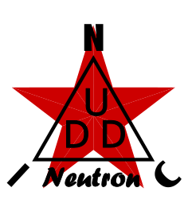

<p align="center">
  
</p>

★ N.I.C. ★

# Neutron — fotonásobičový neutronový kanál

[English](README.md) · **Čeština** · [Русский](README.ru.md)

> **Koncept ve fázi návrhu — nic není postaveno.** Hlavice, stínítka a čtení → [`HARDWARE.md`](HARDWARE.md); deska, na kterou přistává → [`../positron/HARDWARE.md`](../positron/HARDWARE.md); hřbitov — co se zkusilo, co padlo a proč → [`WHY.md`](WHY.md).

**`Neutron` počítá neutrony v nízkonapěťové variantě**: stoh dvou stínítek `⁶LiF/ZnS(Ag)` s moderátorem z PMMA mezi nimi, čtený fotonásobičem třídy 3 až 5 palců, jehož anoda je na **kanálu 1 `Quark-Neutron/Positron`**. Výška každého impulzu říká, které stínítko zablesklo, takže dává **dva počty — tepelný a epitermální — a žádnou energii**.

**Jede v záznamu Positronu**: oba počty jsou bajty 8–11 32 B záznamu Positronu, dva `uint16` před jeho deseti pásmy (`../photon/BUS.md`), pod NUMBER Positronu, protože čtyři bajty jsou celý kanál. **NodBus typ 10 je pro něj rezervován**: sestava, která chce `Neutron` na vlastním NUMBER, vezme typ 10 a nic jiného se na desce nemění.

**Jeho vysoké napětí dává kV zdroj Helionu** (`../../tubes/helion/`), postavený pro tuto hlavici — tři stupně násobiče, odbočka ~1200 V, taktovaný na `SYNC` z desky.

```
   screen · PMMA · screen ──▶ photomultiplier (kV source, ~1200 V) ──▶ THS4551 ──▶ Quark-Neutron/Positron, channel 1
                                                                                  ──▶ thermal · epithermal, in Positron's record
```

## Soubory

| Soubor | Obsah |
|---|---|
| [`HARDWARE.md`](HARDWARE.md) | stoh, fotonásobič a jeho patice, stínění, skříň, fyzika stínítka |
| [`WHY.md`](WHY.md) | hřbitov (co se zkusilo, co padlo a proč) — cesty k energii neutronu, čtení přes SiPM, sestava s jedním stínítkem |

## Licence

Hardware: CERN-OHL-S v2 (`../../../LICENSE-HW`) · Software: MIT (`../../../LICENSE`) — Copyright (c) 2026 NIC — Native Intellect Community
