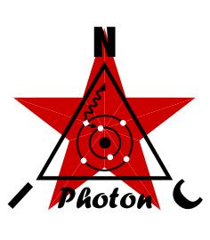

  

★ N.I.C. ★

# Photon — гамма-блок

[English](README.md) · [Čeština](README.cs.md) · **Русский**

> **Концепция на стадии проектирования — ничего не построено.** Цифры проверяются по даташитам и самим компонентам, прежде чем будет сделана плата.

> Плата и слой H7A3, общий для обеих сцинтилляционных плат: [`HARDWARE.md`](HARDWARE.md); компоненты шин питания — общие для семейства (`../../../galvani/HARDWARE.md`). **Сборка Photon на GM-трубках — это высоковольтный вариант**, считаемый на `Quark-Tubes`: [`../../tubes/HEADS.md`](../../tubes/HEADS.md).

**Photon** следит за **гамма- и рентгеновским излучением** — энергичным светом, который испускают радиоактивный распад, космические лучи и гамма-вспышки, сопровождающие большие грозы (TGF). Гамма- и рентгеновское излучение — это **фотоны**, одна величина, различаемая по происхождению, а не по энергии, — и Photon — блок, который её измеряет, **в двух сборках**:

- **Сцинтилляция — NOD, NodBus тип 9 `Photon`, один NUMBER**: куб CsI(Tl) + SiPM + PIN на общей плате H7A3/`AD9251`, счёт *и* энергия каждого события. Конструкция — [`SCINTILLATION.md`](SCINTILLATION.md); контракт шины — [`BUS.md`](BUS.md).

  **Каждый кадр он публикует одну запись 32 B**, целиком накопленную с начала секунды, так что кадр 127 несёт всю секунду, а разность двух кадров — один кадр: **счёт `uint16` · сумма энергий событий `uint32` в keV · наибольшее одиночное событие `uint16` · двенадцать энергетических полос**. Среднее — это сумма, делённая на счёт, медиана интерполируется в полосе, пересекающей 50 %, а доза — та же сумма × константа, — всё дальше по цепочке и точно. Ничто, что нельзя складывать, блок не покидает, а флаги — это байт `status` в заголовке кадра, а не полезная нагрузка.

  **SiPM и PIN — это ОДНО измерение, переключаемое для каждого события по его энергии**: SiPM ниже 500 keV, PIN выше 700 keV, между ними — линейное смешивание. Два прибора с перекрывающимися окнами дают одно показание, а не два ряда: ниже своего потолка SiPM — лучший прибор, а выше искажает, у PIN — наоборот. За парой следит **отношение** двух площадей на каждом событии, пересекающем оба порога, к сохранённой константе — отклонение больше 10 % означает `HEALTH` DEGRADED, так что канал, уходящий в насыщение, сообщает о себе сам, не занимая отдельного адреса.

- **Трубки — высоковольтный вариант**: GM-трубки за ступенчатым Pb, K1 · K2 · K3, считаемые на `Quark-Tubes` и идущие в его кадре mini ([`../../tubes/HEADS.md`](../../tubes/HEADS.md)). Рядом со сцинтилляционной сборкой стоят нейтронная сторона (**`Neutron`**, канал в записи Positron, тип 10 зарезервирован для него) и бета-блок (**Positron**).

## Преобразователь и шина питания

`AD9251-80` — двухканальный 14-битный, 80 Msps, `DRVDD` 1,8–3,3 V, конфигурация по SPI, внутренний делитель тактовой частоты 1–8 и вывод `SYNC`, поэтому **он берёт тактовый сигнал дискретизации, который ему отдаёт шина**, а не вырабатывает свой ([`HARDWARE.md`](HARDWARE.md) владеет этим компонентом; `AD9265-80` у Marconi — его одноканальный 16-битный родственник). Два канала — ровно то, что нужно **одной головке**: гамма-кристалл считывают одновременно SiPM и PIN, и их отношение имеет смысл только на одном и том же событии, поэтому эта пара владеет преобразователем. **Один `AD9251-80`, два канала, на плату** ([`HARDWARE.md`](HARDWARE.md)). Компонент тактируется со скоростью слов, 88,08 MHz, и внутри делит на два, потому что его выход с чередованием — DDR, а PSSI читает по одному фронту; те же 88,08 MHz — тактовая частота чтения PSSI. *(Посадочное место и карта регистров — общие для семейства: `AD9648`, `AD9258`, `AD9268`, `AD9650` ставятся без изменений; ни один из них не требуется.)*

**Всё работает от 1,8 V, ровно как у Marconi.** `DRVDD` допускает и 3,3 V, но причин для этого нет. Переход на 3,3 V ничего не даёт и стоит второй схемы питания. Интерфейс к станции остаётся на 3,3 V через преобразователи уровней.

**Скорость — `21 × 2²¹` = 44,040192 MSPS на канал**, 88,080384 MHz на выводах. Чередование стоит половины частоты дискретизации, так что двоичная ступень была бы 2²⁵; это наибольшая скорость, которая сохраняет целое число отсчётов **на секунду и на кадр**, получается целочисленной PLL и оставляет выводы ниже 100 MHz PSSI.

**Что он даёт на канал:**

| канал | длительность электрического импульса | отсчёты |
|---|---|---|
| гамма CsI(Tl) | 1 µs | **44,0** |
| пластиковая бета — высвечивание 285 ns у `EJ-240` на зарядовом каскаде 603 ns у Positron | ~600 ns | **~26** |
| фронт одной микроячейки | 54 ns | **2,38** |

По первым двум читается энергия. **Третий не измеряется**: калибровочная линейка, шаг одной ячейки, — это кумулянтная статистика потока темновых импульсов между событиями (`SCINTILLATION.md`, *The calibration chain*), и от числа отсчётов она ничего не требует; следующая ступень вверх оставила бы на выводе PSSI меньше 8 % запаса, и она никому не нужна.

**На сцинтилляционной стороне высокое напряжение не отслеживается.** Ничто на двух платах не превышает ~30 V; единственный киловольт на этой стороне — у фотоумножителя, на kV-источнике Helion.

## Файлы

| Файл | Содержимое |
|---|---|
| [`HARDWARE.md`](HARDWARE.md) | плата `Quark-Photon` — и слой H7A3, общий для обеих сцинтилляционных плат |
| [`FIRMWARE.md`](FIRMWARE.md) | описание прошивки — один образ на этой плате и на плате Positron |
| [`SCINTILLATION.md`](SCINTILLATION.md) | физика и входной тракт гамма-головки, калибровочная цепочка, справочные таблицы, спецификация компонентов |
| [`BUS.md`](BUS.md) | запись 32 B, Photon и Positron |

## Лицензия

Аппаратная часть: CERN-OHL-S v2 (`../../../LICENSE-HW`) · Программы: MIT (`../../../LICENSE`) — Copyright (c) 2026 NIC — Native Intellect Community
