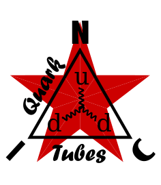

<p align="center">
  
</p>

★ N.I.C. ★

# Quark-Tubes — trubicová jednotka

[English](README.md) · **Čeština** · [Русский](README.ru.md)

> **Koncept ve fázi návrhu — nic není postaveno.** Čísla se ověřují proti katalogovým listům a součástkám, než vznikne deska.

> **mini-NOD, NodBus mini typ 2 `Quark-Tubes`** — vysokonapěťová sestava Quarku, radiační části: každá trubice sestavy počítaná na jednom H523, čtyři kanály v 8 B mini payloadu (užitečná data) za Argusem. Radiační část je [`../README.md`](../README.md); nízkonapěťová sestava je [`../scintillation/`](../scintillation/).

**Jedna deska a hlavice na ní.** `Quark-Tubes` počítá tři GM trubice Photonu (K1 holá, K2 se zastavenou β, K3 za Pb) a neutronový detektor na K4 — trubici He³/BF₃ Helionu, nebo sloučených třináct trubic prstence Gadolin/Rhodion — a napájí každou GM trubici ze svého jediného modulu ~400 V. Hlavice nenesou žádný MCU ([`HEADS.md`](HEADS.md), [`gadolin/`](gadolin/)).

## Co detekuje

Dvě fyzikálně odlišné úlohy sdílejí jednu sestavu moderátoru / reflektoru / olova (`../NEUTRONS.md`):

- **Gama, v hrubých energetických pásmech.** GM trubice za **odstupňovanými absorbéry Pb / PE** — diferenciální absorpce mění sadu obyčejných trubic v hrubý spektrometr (holá, se zastavenou β, za Pb → **K1 / K2 / K3**, od měkkého k tvrdému — `HEADS.md`).
- **Neutrony.** Neutron nemá náboj — musí se nejprve konvertovat. Dvě cesty, obě na levných GM trubicích **SI-22G s nerezovou stěnou** (rodina **(b)** a **(c)** v `../NEUTRONS.md`): okamžité **gama ze záchytu na ¹⁵⁷Gd** (účinnost ~1 %, ale umožňuje koincidenční okno pod 1 ms), nebo **zpožděná tvrdá beta z aktivační fólie** (~30× účinnější na jeden záchyt, ale zpožděná o poločas rozpadu). Účinnost je poctivě **~1–2 %**; přístrojem je síť, ne jednotlivý uzel.

Proporcionální trubice He³ (~70–96 %) jsou špičkovou alternativou, ale jsou drahé a potřebují nábojový předzesilovač; trubice podle náplně a kde je koupit jsou v `../NEUTRONS.md`; hlavice je [`helion/`](helion/).

## Moderátor / reflektor

Rychlé neutrony se zpomalují v moderátoru; **grafitový reflektor** (uzavřený, vč. čel) je rozptyluje zpět, takže jich trubicí projde víc → **vyšší účinnost záchytu**. Při záchytu se reakce rozštěpí (He³ → p + t; Gd(n,γ) → okamžité γ) → **jeden impulz; jeden neutron = jedno započtení**. Počet za rámec se **saturuje na 65535** (`uint16`, [`BUS.md`](BUS.md)); reflektor držte dost tenký, aby **doba doznívání (die-away) neutronů ≪ 7,8 ms** (počty se nesmějí rozmazat přes rámce).

## Integrace do NIC

**Quark-Tubes je trubicová jednotka: jedna deska, mini-NOD — NodBus mini typ 2, `0x21` pro jednotku 1.** *(Tato sekce patří Quark-Tubes; kontrakt scintilačních NODů je v [`../scintillation/photon/BUS.md`](../scintillation/photon/BUS.md).)* Každou trubici počítá sama, sčítá do intervalů podle síťových hodin a každý interval jede ve vlastním rámci — žádné dotazování, žádné značky, časem je slot. Rozložení kanálů a celý kontrakt sběrnice jsou v [`BUS.md`](BUS.md).

**Je to mini-NOD a důvodem jsou hodiny.** Práce s TGF potřebuje počty i úder na jedné časové základně (`../../tesla/DETECTION.md`) a ModBus žádný čas nedává. **NodBus mini ano** — stejné rámcování, stejné TDMA, stejné hodiny, 8 B payloadu — takže Quark-Tubes sedí na segmentu Argusu a přivádí `CLK` na **vstup externích hodin časovače**, kde hranice intervalu vychází jako dělení stupně segmentu celou mocninou dvou (`÷4096` z 2¹⁹ je rámec 128 Hz). **Jeho intervaly jsou rámce stanice, ne jeho vlastního oscilátoru**, takže není žádný drift ke korekci a žádné PTP ke spouštění: deska nenese žádný krystal — stupeň disciplinuje HSI přes PLL, jako u Gauss a Pascal — jádro taktuje UART a jediným zbývajícím časovým členem je samotná synchronizační hrana — řádu ns, pevná, změřená a odečtená na kartě (`../../core/blocks/nodbus.md`).

**Mini typ 2** (`../../core/PROTOCOL.md` §2).

- **Kde probíhá počítání — všechno na Quark-Tubes.**
  - **Trubicová sestava Photonu** (γ/rentgen, GM za odstupňovaným Pb) a **trubicová sestava Helionu** (proporcionální trubice He³) zůstávají **impulzními hlavicemi bez MCU**; jejich tvarované impulzy jdou **do H523 Quark-Tubes** na téže sestavě a přistávají **přímo na hardwarových vstupech časovačů**. Jejich počítání nestojí vůbec žádný čas CPU.
  - **Gadolin** (konvertor z Gd) a **Rhodion** (jeho rhodiová/Rh varianta) mají **13 trubic SI-22G (1 centrální + 12 v prstenci) na EXTI**, sloučených softwarově, takže trubice rozsvícené jednou částicí se započítají jednou. Toto sloučení je **neutronový kanál** — trubice Helionu plní tentýž kanál v sestavě, která nese místo prstence ji (rozložení vlastní `BUS.md`).
  - **Obě úlohy jsou tedy rozděleny hardwarem, ne deskou:** třináctitrubicová koincidence bere softwarová přerušení, protože musí porovnávat časy příchodu; všechno ostatní bere vstup časovače a počítá se, aniž by si toho jádro všimlo.
- **MCU:** **H523** na 2²⁷ jako každý H523 ve stanici. Bleskové vstupní obvody jsou na vlastní desce H7A3 Tesly ([`../../tesla/README.md`](../../tesla/README.md)), ne tady.
- **Transceiver:** na komunikační desce jako u každého uzlu; CRC zahodí rámec zasažený přechodovým jevem a akumulátory dalšího rámce ponesou jeho počty.
- **VN:** jediný zalitý modul ~400 V na desce, každá GM trubice na jeho sběrnici ([`HARDWARE.md`](HARDWARE.md), *The one 400 V source*); trubice He³ na kV zdroji Helionu ([`helion/`](helion/)).

### Vzdálené VN — zdroj cestuje, hlavice zůstává (topologie nasazení)

VN měnič je hlučná část a **nemusí** sedět u senzoru. Obecná podoba u libovolného detektoru: **VN generovat na straně stanice a vést ho kabelem nahoru; na vzdáleném místě sedí jen detektor — plus čtecí zesilovač tam, kde ho signál potřebuje.** Co smí cestovat, určuje *integrita signálu*, ne pohodlí:

- **Robustní impulz s amplitudou ve voltech (GM trubice — Photon, Gadolin) jde kabelem přímo dolů.** Není tu žádný nábojový frontend k ochraně, takže celá detektorová hlavice zůstává na místě a **oddělí se jen VN zdroj** ([`gadolin/HARDWARE.md`](gadolin/HARDWARE.md) §2).
- **Nábojový frontend (trubice He³) se musí převést přímo u trubice.** Transimpedanční stupeň sedí milimetry od katody; kabel vede kV nahoru, 3,3 V nahoru a impulz komparátorů dolů ([`helion/HARDWARE.md`](helion/HARDWARE.md) §1). kV zdroj zůstává na vlastní desce.

Zákmity spínaného měniče tak v každém případě zůstávají mimo citlivé vstupní obvody.

### Datový model

Počty jsou **rychlá data se společným časovým razítkem** — celá podstata je orazítkovat radiační záblesk proti úderu blesku na jedněch síťových hodinách. Každý kanál je **jeden `uint16`, akumulátor nulovaný na sekundě** (GM trubice dosahuje nejvýš ~1000 CPS — šířka odpovídá formátu scintilačních jednotek, ne nějaké trubici); dále v řetězci se sčítá na CPS/CPM a záblesk TGF vystoupí jako špička se společným razítkem. Počty jedou v **8 B mini payloadu** — **beta · měkké γ · tvrdé γ · neutrony odvozené na jednotce, nebo čtyři detektory surově, K1..K4** — a rozložení vlastní [`BUS.md`](BUS.md). Intervaly leží na síťových hodinách a časem je slot, takže nikde nejsou žádné offsety, žádné značky ani pole stáří.

Tři GM trubice jednoho typu v jedné výšce nad plastovou depoziční deskou — holá, se zastavenou β, za Pb — dávají odečtením beta kanál a dva gama kanály; K4, neutronový kanál, je Gadolin/Rhodion nebo trubice Helionu, podle toho, co je osazeno.

**Tloušťka Pb je dána klimatem, není to pevná specifikace** — je to **ekvivalentní tloušťka ideálního Pb**, volba stavitele (lokalita bez krupobití si vystačí s lehčím); filtr postavte z Pb nebo z jiného materiálu, ale jiný materiál znamená **přepočet na jeho Pb ekvivalent a novou kalibraci trubice**. Vlastní to `HEADS.md`.

## Strom

```
tubes/        Quark-Tubes — the board and the unit  mini 2
├── HEADS.md  Photon — the GM tubes K1–K3
├── helion/   Helion — the He³ / BF₃ tube on K4, and the kV source
└── gadolin/  Gadolin / Rhodion — the thirteen-tube ring on K4
```

## Soubory

| Soubor | Obsah |
|---|---|
| [`HARDWARE.md`](HARDWARE.md) | deska — modul 400 V a jeho sběrnice, pět NTC, piny, časovače, hodiny disciplinované stupněm |
| [`FIRMWARE.md`](FIRMWARE.md) | popis firmwaru — čítače, sloučení prstence, interval, registry |
| [`BUS.md`](BUS.md) | mini rámec — čtyři kanály, surové nebo odvozené |
| [`HEADS.md`](HEADS.md) | GM hlavice (K1–K3, filtry, tvarovací deska, pozadí při uvádění do provozu) |
| [`helion/`](helion/) | Helion — hlavice He³/BF₃ na K4 a kV zdroj |
| [`gadolin/`](gadolin/) | prstenec Gadolin/Rhodion — jeho deska a jeho konstrukce |

## Licence

Hardware: CERN-OHL-S v2 (`../../LICENSE-HW`) · Software: MIT (`../../LICENSE`) — Copyright (c) 2026 NIC — Native Intellect Community
