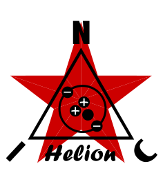

<p align="center">
  
</p>

★ N.I.C. ★

# Helion — the He³ / BF₃ neutron head

> **Design-stage concept — nothing built.** The head and its kV source → [`HARDWARE.md`](HARDWARE.md); the
> graveyard → [`WHY.md`](WHY.md).

**Helion** counts **neutrons** on the tube variant: a **³He proportional tube** — or BF₃, or a
boron-lined tube, set per the fitted tube's sheet — on `Quark-Tubes`' neutron channel **`K4`**, with
**`K4A`** beside it as the tube's health. The name is literal: the nucleus of helium-3 is a
**helion**. It is the premium of the tube variant's two neutron heads; **Gadolin** (`../gadolin/`)
is the cheap one, and a build carries one or the other on the same `K4`.

**It owns the kV source**: an `LT8331` flyback into a Cockcroft-Walton ladder of 400 V stages,
`FBX`-regulated across the real output, a module of its own beside the head — tapped 1300–2000 V
for the tube. The low-voltage variant's photomultiplier, `Neutron`, runs on the same module in its
own build.

## In the network

- **The count rides Quark-Tubes' mini frame on `K4`** — the same channel Gadolin fills on a build that
  carries the ring instead (`../BUS.md` owns the layout), co-stamped with the gamma channels and
  with Tesla's strikes for the TGF correlation.
- **Siting and leads** as every exposed head: its own post beside the station, never the mast, the
  leads buried.

```
   kV source (LT8331 → ladder, 1300–2000 V) ──▶ He³ / BF₃ tube ──▶ LTC6268 → TLV9061 → two comparators ──▶ K4 · K4A on Quark-Tubes
```

## Files

| File | Contents |
|---|---|
| [`HARDWARE.md`](HARDWARE.md) | the tube, its charge front end, the two thresholds, and the kV source |
| [`WHY.md`](WHY.md) | the graveyard |

## Licence

Hardware: CERN-OHL-S v2 (`../../../LICENSE-HW`) · Software: MIT (`../../../LICENSE`) — Copyright (c) 2026 NIC — Native Intellect Community
