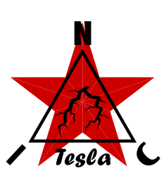

<p align="center">
  
</p>

★ N.I.C. ★

# Tesla — přijímač blesků a sferiků

[English](README.md) · **Čeština** · [Русский](README.ru.md)

> **Koncept ve fázi návrhu — nic není postaveno.** Čísla se ověřují proti katalogovým listům a součástkám, než vznikne deska.

**Tesla je přijímač blesků stanice: NodBus typ 7, NOD.** Tři feritové tyče, diferenciální vstupní
obvod, čtyřkanálový převodník ΔΣ na 2²⁰ SPS a STM32H7A3, který provádí detekci, sdílejí jednu desku
v jedné utěsněné plastové krabici, s tyčemi uvnitř. Pojmenován po Nikolu Teslovi.

**Co měří** — každý impulz v pásmu 5 kHz – 512 kHz, a pro každý z nich:

- **čas**, diskriminací s konstantním podílem na náběžné hraně, s přesností ±0,48 µs na hodinách
  sítě — právě to síti umožňuje lokalizovat výboj podle času příchodu;
- **amplitudu se znaménkem**, logaritmicky, v poli 128 dB s krokem 0,016 dB — prostor pro 98 dB
  přijímače, od šumového dna ~9 pT po ořez ~690 nT;
- **třídu** — blesk, oblouk na elektrickém vedení, nebo neznámé — určenou na uzlu, protože jen uzel
  má surový proud dat a pod ním fázi sítě;
- tam, kde je aktivován doplňkový NOD, **čtyři další bajty**: surový azimut, dobu náběhu a dvě
  mezipásmová zpoždění, z nichž se určuje vzdálenost zdroje.

Trvalý zdroj — jiskřící izolátor, vedení s plazivými výboji — se posílá jako stav, čtyři záznamy
za sekundu, a průběžné šumové dno se posílá jednou za sekundu. Uzel přemýšlí tam, kde to dokáže jen
on, a zůstává hloupý tam, kde je síť lepší: polarita, seskupování výbojů a poloha patří serveru.

**Co vidí jeden uzel.** Detekuje, ale nelokalizuje — poloha je TOA napříč stanicemi. Výboj uvnitř
~3–4 km saturuje tyče: tento slepý kruh je obětován záměrně, protože síť vidí to, co nejbližší
stanice nevidí. Oblouk nemá slepý kruh v žádné vzdálenosti, v jaké může stanice stát, a jeho dosah
určuje QRN lokality.

## Jak je připojen ke stanici

**Tesla je sám na vlastní odbočce Bifrostu — bod–bod, plný duplex, konec trasy na straně jednotky.**
Nenese žádnou linkovou součást: napájecí deska pro jeho napájení a komunikační deska pro jeho médium
se zasouvají do jeho zásuvek a trasa — měď nebo sklo, 48 V nebo 300 V — na jeho vlastní desce nic
nemění. Hodiny jsou Kronosovy, na hodinovém páru odbočky; deska k nim zavěsí své jádro, takt
převodníku i každý vzorek. Bere si **jeden NOD, dva nebo tři** — události, stavy zdrojů, doplněk —
na téže odbočce.

**Deska nese druhou jednotku.** S nahraným druhým obrazem je to **Pip**, NodBus typ 12 —
dlouhovlnné nosné a dlouhovlnný čas stanice, obsluhovaný na druhém datovém konektoru desky, `TIME OUT`,
které obraz Tesla nechává nečinné (`pip/`). **A třetí**: s obrazem pro poruchy vedení je to
**Steinmetz**, NodBus typ 13 — zdroje vázané na síťovou frekvenci na elektrickém vedení, z vozidla
nebo z lokality, se vstupním obvodem utlumeným o 20 dB na útlumových svorkách (`steinmetz/`).

```
   3 ferrite rods ──▶ 3× S1/S2 THS4551 ──▶ ADS127L14, 2²⁰ SPS ──SAI──▶ ┌─────────────────────────┐ ── NodBus spur, type 7 ──▶ BIFROST
   REF6041 4,096 V ────────────────────────▶ REFP                      │ TESLA — STM32H7A3       │    (Pip's image: type 12,
   4 NTCs on the H7A3's ADC                                            │ filterbank · detector · │     and TIME OUT to Kronos)
   one IP68 plastic box; the Galvani sockets and the 12 V at its edge  │ CFD · classifier        │
                                                                       └─────────────────────────┘
```

## Strom

```
tesla/          Tesla — lightning and sferics; one board, three images            NodBus 7
├── design/     the rod worksheet, rod_calc.py; rod_field.py, its solve; chain.py, the clip and the floor
├── pip/        Pip — the longwave carriers: the SID channel, and time            NodBus 12
└── steinmetz/  Steinmetz — line faults on power lines, from a vehicle or a site  NodBus 13
```

## Soubory

| soubor | obsah |
|---|---|
| [`HARDWARE.md`](HARDWARE.md) | deska — řetězec s hodnotami součástek, převodník, hodiny, napájecí linky, teploměry, piny procesoru, zásuvky, součástky |
| [`DETECTION.md`](DETECTION.md) | časování pomocí CFD, banka filtrů, pásy, tři třídy a zámek na síťovou fázi, sestava „grid-only“, korelace s TGF |
| [`BUS.md`](BUS.md) | zpětný offset, záznam události 4 B, doplňkový NOD, pravidlo pro to, co jde na vodič, jeden až tři NODy |
| [`FIRMWARE.md`](FIRMWARE.md) | popis firmwaru — start, stavy, sběrnice, čas, trvale aktivní cesta, vysílání, registry, poruchy |
| [`CONSTRUCTION.md`](CONSTRUCTION.md) | komolý kužel a ta jediná plastová krabice, tyče a jak je vybrat, vinutí, teploměry tyčí |
| [`WHY.md`](WHY.md) | hřbitov — zamítnuté alternativy a překonané stavy |
| [`pip/`](pip/) | Pip — tatáž deska s druhým obrazem |
| [`steinmetz/`](steinmetz/) | Steinmetz — tatáž deska s obrazem pro poruchy vedení |
| [`design/`](design/) | pracovní list tyče — kalkulačka pro tyč, kterou lze koupit: permeabilita, indukčnost, citlivost a šumové dno |

## Licence

Hardware: CERN-OHL-S v2 (`../LICENSE-HW`) · Software: MIT (`../LICENSE`) — Copyright (c) 2026 NIC — Native Intellect Community
