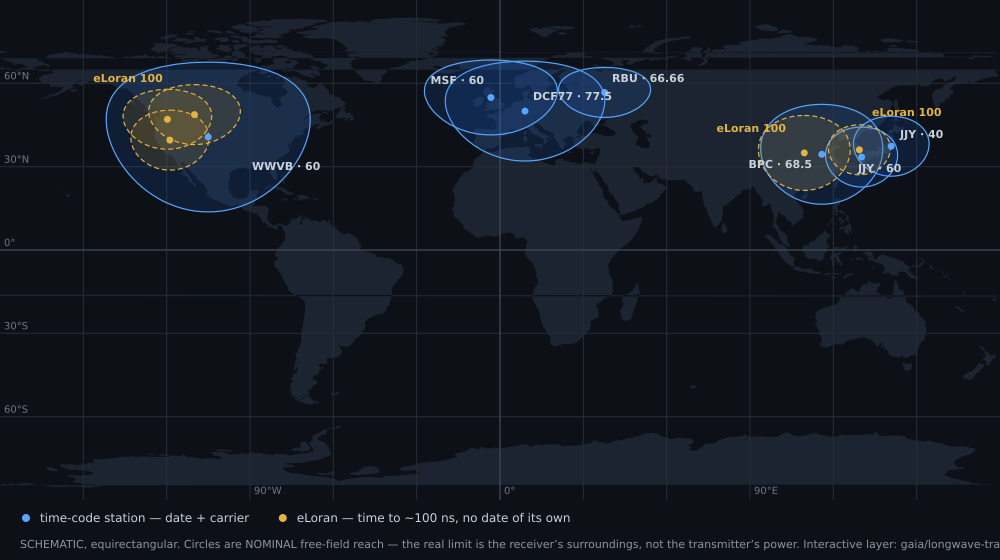

★ N.I.C. ★

# Pip — the carriers

> **Design-stage concept.** The figures are verified against the parts' sheets and the parts
> before a board is made.

What Pip listens to, what each carrier gives, what the path costs, and how the image keeps the
atmosphere's noise out of a carrier's level and phase. The firmware that does it, step by step,
is `FIRMWARE.md`.

## Two services on every carrier

Every longwave transmission carries two services at once:

- **the carrier** — caesium-derived; phase-locking to it measures the station's grid against an
  atomic rate at any distance, because a wandering path averages out;
- **the time code** — which second it is, accurate to nothing but the **path delay**, 3,33 µs a
  kilometre: a constant where the path is known, a variable where it is not.

**Knowing the path is the boundary:**

- **Near the transmitter — tens of km — the path is a constant.** Only the groundwave arrives,
  with no diurnal wander, and the delay is arithmetic (5 km = 16,7 µs), computed once and
  subtracted. That close, a time-code station gives **absolute time inside the 1 µs contract**.
- **Far from it, the path breathes.** Groundwave and skywave mix, the reflection height moves
  between day and night, the phase wanders by tens of µs: the time code is **millisecond-class**
  and only the *rate* survives. Relative timing across the station is untouched — every unit
  counts Kronos's clock — and absolute time, which would drift at the TCXO's ±1 ppm ≈ 86 ms a
  day, is held to the **µs-a-day** class: holdover.
- **eLoran (90–110 kHz) is built to know its own path** — pulsed, and differential eLoran adds a
  reference station that measures the path: **~50–100 ns** at range. Where it is receivable it is
  a second independent time source.

| what is wanted | what it needs |
|---|---|
| **the date and the second** | nothing — decoded from the broadcast once a minute; a second's error would take 150 000 km of path |
| **the grid's rate against an atomic reference** | nothing — a constant delay cancels in a difference |
| **the µs inside the second** | the position and the transmitter table |

**The two families complement each other, because eLoran carries no calendar.** A time-code
station gives identity, eLoran precision. **There is no RTC in the station**, so a site whose only
longwave service is eLoran recovers its rate after an outage but cannot label a record; only a
time-code station closes that loop unaided.

## The path is computed; the table is in the image

A dozen transmitters are worth hearing on the planet, and their coordinates are a few hundred
bytes of flash, so **the table ships inside the image**: great-circle distance ÷ groundwave
velocity, subtracted. What that needs is the station's position, which exists anyway — the archive's
`STATION` section carries it, and the head writes it to `POSITION`. Timing error is position
error ÷ c, so 300 m costs 1 µs and a phone's 5–10 m is a hundred times better than needed. Over a
long path the ground conductivity beneath the route adds an error geometry cannot predict, and
the learning holds it; near the transmitter it is negligible.

## The band — 34–120 kHz for time, the SID carriers below it

**One digital band, one image, everywhere**; the analogue front is Tesla's. The time carriers sit
in 34–120 kHz; the SID channel tracks what it hears from 17 kHz up, the military VLF transmitters
(NAA 24, DHO38 23,4, GQD 19,6 kHz) included — a level is a level, and those are the strongest
D-region probes there are.

```
34──40────50────60──66,66─68,5──77,5────90────100────110──120 kHz
 ↑ JJY MSF RBU BPC DCF77 └── eLoran ───┘ ↑
corner (JP) WWVB (RU) (CN) (DE) US · CN · KR corner
              (US)
   └──────── time-code stations ────┘ └── time, ~100 ns ──┘
```

| service | f | site | power | nominal reach | gives |
|---|---|---|---|---|---|
| JJY | 40 / 60 kHz | Ohtakadoya + Hagane, Japan | 50 kW | ~1200 km | date + carrier |
| MSF | 60 kHz | Anthorn, UK | 17 kW | ~1500 km | date + carrier |
| WWVB | 60 kHz | Fort Collins, USA | 70 kW | ~3000 km | date + carrier |
| RBU | 66,66 kHz | Taldom, Russia | ~10 kW | ~1000 km | date + carrier |
| BPC | 68,5 kHz | Shangqiu, China | 90 kW | ~2000 km | date + carrier |
| **DCF77** | 77,5 kHz | Mainflingen, Germany | 50 kW | ~2000 km | date + carrier — the strongest in central Europe |
| **eLoran** | 90–110 kHz | South Korea (operational) · China (BPL) — the US Loran-C chain was shut down in 2010 and the UK eLoran in 2015 | — | ~1000–1500 km | **time to ~100 ns; no date of its own** |



> The circles are *nominal free-field* reach. What decides a site is the receiver's surroundings
> ([`../../gaia/SITING.md`](../../gaia/SITING.md), rule 6); a reinforced-concrete building can cost more
> than a thousand kilometres.

**eLoran's timing point is the third zero crossing of the 100 kHz carrier**, ~30 µs in, before the
earliest skywave, so 90–110 kHz must be flat **in phase as well as amplitude** — which Tesla's
chain gives, its poles an octave above the 512 kHz band top. **Every Loran transmitter is on the
same 100 kHz**: identity is the **GRI**, the **coding delay** and the **phase code**, so stations
are separated by correlation in time; the zero crossing is computed from a known-frequency
sinusoid fitted across tens of samples, and the hard part is cycle identification, not the sample
rate. **eLoran lives outside Europe**: three former US stations are held in service, China builds
it out, South Korea operates it; Europe's chains went off on 31 December 2015. The European
telecontrol transmitters (129,1 / 135,6 / 138,8 kHz) are rejected digitally.

**The military VLF transmitters are SID carriers, not time carriers**: MSK flips the carrier phase
and they leave the air without notice, so they are tracked for their level and never for the time.

**Parts of the world hear nothing** — Africa, South America, the central Pacific. There Pip does not
lock and says so: the time is `$PNIC` *no lock*, and the SID channel ships whatever carriers exist.

## Where Pip is worth ranking first

**A station that cannot see the sky.** The common case is not a solar catastrophe; it is an
ordinary site where *this* station's GNSS is bad while the world's is fine — forest canopy, a
valley, a shed over a borehole, a failed antenna, a jammed band. At 34–120 kHz the signal passes
foliage, walls and shallow ground that a 1,5 GHz satellite signal does not. There Pip is ranked
first at Kronos and no GNSS antenna is fitted — a deployment choice, the same board and image.

**What it does not cover: a severe space-weather event takes both references.** GNSS goes first,
but longwave reaches the receiver off the ionosphere, and a flare is what disturbs that layer: the
reflection height shifts and the tracked phase moves for minutes to hours — the very sudden
ionospheric disturbance the SID channel measures. Then the station's time is Kronos's TCXO in
holdover, and the state of health says so.

## It finds its own transmitters, and they vote

**No per-site configuration.** The image scans the band, ranks the steady lines by strength and
stability and tracks the best, up to eight: identical firmware ends on DCF77 in Europe, WWVB in
the USA, BPC and BPL in China, eLoran in Korea. **Three or more time carriers vote**: a transmitter's
maintenance outage is a re-ranking, local noise hits one frequency and rarely three, and when
independent atomic-locked sources disagree beyond their spread the fault is at this end — reported,
never averaged in.

**Learning runs while GNSS is good; steering runs only when it is gone.** While Kronos holds the grid
to GNSS, Pip measures every carrier's phase against a true grid and learns the path — the offset per
carrier and its daily shape, which the ionosphere moves repeatably between day and night. When GNSS
goes, it subtracts the learned curve, and what remains is the grid's real error: a GPSDO's holdover
discipline.

## The noise floor is impulsive — so it is gated

At a properly sited station what is left under the signal is **atmospheric** noise — the world's
~50 flashes a second in the same waveguide, well above any amplifier's floor, and **not Gaussian**:
a sparse train of needles. **Needles are gated, not out-resolved**: an envelope-against-background
test flags the impulse, the input mutes for its few tens of µs, and a 1 Hz tracking loop coasts
across the hole.

- **A near stroke that clips is gated too.** The chain rails at **≈ 690 nT** (`../HARDWARE.md` §0.4),
  and the gate does not need the amplitude, only that something is far above the background; a
  railed chain says so louder than anything. The detector that serves Tesla's sferics serves as
  Pip's blanker, clipped or not.
- **The count costs nothing.** 50 flashes a second at a few tens of µs is **0,25 % of the window**,
  and a 1 s coherent block loses `20·log₁₀(1−f)` of level to a gated fraction `f` — **0,02 dB**,
  about one step of the record's 2⁻⁶ dB. An overhead storm at ten strokes a second is the same order.
- **What costs is the length of a clipped event**: a needle mutes for tens of µs, a stroke that
  rails the chain mutes until the RC chain and the converter have recovered.
- **The gated fraction is reported, because a storm and a flare look alike.** Blanking pulls the
  carrier's level down, and so does a SID; without the flag the archive cannot tell a solar flare
  from a thunderstorm overhead (`FIRMWARE.md` §6).

| | value |
|---|---|
| input bandwidth | 86 kHz |
| tracking loop bandwidth | 1 Hz |
| **processing gain** | 10·log₁₀(86 000) = **49 dB ≈ 8 bits** |

The gain is bought by averaging, which recovers only what is still in the samples, so the decimator
keeps the converter's full width and narrows only after the narrowband filter. The converter's
instantaneous bits buy **dynamic range, not accuracy** — a strong local transmitter and a weak
distant one, 60–80 dB apart, both fit at once.

## An arc is the opposite case — its residue is a line

**A stroke arrives at a random time and its residue spreads as floor; an arc is mains-locked and its
residue lands on the carrier.** A gap fires twice a mains cycle, so its spectrum is a comb on 100 Hz
(300 Hz where all three pairs fire, 33 Hz on 16,7 Hz traction — the fundamental is learned, not
compiled in, `../DETECTION.md`). **Every longwave time carrier sits on a whole hundred hertz** —
DCF77 77 500, MSF and WWVB 60 000, BPC 68 500, JJY 40 000, eLoran 100 000 — **so every comb tooth
lands in a tracked carrier's own bin and adds coherently there**, and a 1 s Goertzel cannot separate
what sits in its bin. Unblanked arc energy corrupts level and phase, where unblanked lightning only
raises the floor. RBU's 66 666 Hz is the one carrier the comb misses.

- **Against an arc the blanker runs locked, not reactive.** The firing instants are periodic, so the
  gate is **predicted** from the learned fundamental and phase: no detector latency, nothing missed
  at the leading edge, the gate closed before the front arrives. The reactive detector keeps running
  underneath for everything aperiodic.
- **Constant blanking costs level, not phase.** Blanking multiplies by a real non-negative gate, so a
  gated carrier loses the gate's mean and gains sidebands a whole comb spacing away — 100 Hz off,
  outside a 1 Hz bin. The level drops by `20·log₁₀(1−f)` and the phase does not move: 20 % of
  blanking is 1,9 dB of level and no phase error. Pip is a phase tracker; a level it can lose, a
  phase it cannot.
- **An arc does not defeat the vote.** Each carrier sits on a different harmonic of the fundamental,
  so the residual phase each picks up differs; three carriers disagreeing beyond their spread is the
  rule that says the fault is at this end, and an arc trips it as local noise does.
- **The arc's share is measured by the channel that measures it**: whatever moves one carrier's phase
  against the station's grid and not the others', riding `status` 7 DISTURBED with the gated
  fraction.
