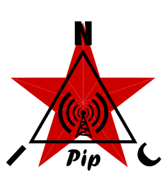

<p align="center">
  
</p>

★ N.I.C. ★

# Pip — dlouhovlnné nosné: kanál SID a čas pro stanici

[English](README.md) · **Čeština** · [Русский](README.ru.md)

> **Koncept ve fázi návrhu — nic není postaveno.** Čísla se ověřují proti katalogovým listům a součástkám, než vznikne deska.

**Pip je deska Tesla s vlastním obrazem: NodBus typ 12, NOD.** S jednou signálovou cestou dělá dvě
věci:

- **kanál SID** — sleduje nosné VLF a LF, které lokalita slyší, stanice časového kódu, navigační
  vysílače a eLoran, až osm, a jednou za sekundu posílá úroveň každé z nich jako záznam nosné:
  stupeň oblasti D v ionosférickém žebříku stanice (Marconi pokrývá oblast F, Sputnik TEC);
- **čas** — na týchž nosných dekóduje datum a sekundu a měří časovou mřížku stanice proti jejich
  fázi odvozené od cesiového etalonu a na své druhé zásuvce, kde je na druhém konci Kronos, se
  vydává za přijímač GNSS: **PPS na vodiči, NMEA na UART**.

Nosná, jejíž úroveň je vědeckým produktem, je tatáž nosná, jejíž fáze je časem.

**Odložen kvůli pokrytí, dotažen do podoby popisu.** Vysílače dosahují do světa, který je už
přístrojově pokrytý; jako zdroj času je Pip k ničemu tam, kde není slyšet žádná nosná, bez stanice
časového kódu obnoví chod, ale ne datum, a silná sluneční událost vyřadí GNSS i dlouhé vlny zároveň.
Jako kanál SID je užitečný všude, kde je slyšet nosná, což je většina pevniny. `FIRMWARE.md` říká,
co obraz dělá; obraz se napíše až po desce.

Pojmenován podle **„pips“** — šesti pípnutí časového signálu BBC Greenwich Time Signal, vysílaného
od roku 1924.

## Jak je připojen ke stanici

**Deska je Teslova, totožná do poslední součástky** — tyče, řetězec, převodník, procesor, napájecí
linky i oba datové konektory jsou osazeny na každé desce a to, čím deska je, určuje obraz v ní.
Hardwarový dokument pro Pip neexistuje: `../HARDWARE.md` je deska, včetně `TIME OUT`.

- **Nahoru: `NB IN`, NodBus typ 12, jeden slot** — za Bifrostem jako každá jednotka, na konci své
  trasy na straně jednotky, napájený přes napájecí desku; měřicí jednotka nikdy nestojí ve skříni.
  Pip #1 je `0xC1`. Hodiny jsou z odbočky a Pip nemá žádný vlastní oscilátor, který by se musel učit.
- **Do strany: `TIME OUT`, do druhé zásuvky RX/TX + PPS Kronosu** — přes druhou komunikační desku
  na vlastní trase, NMEA na kanálu A a PPS na kanálu B, buzené směrem ven u Pip a přijímané
  u Kronosu; 3,3 V si bere z interfacové napájecí linky desky stejně jako ta první. Pip je tam zdrojem
  času a Kronos ho řadí vůči GNSS a měří vzdálenost trasy.
- **`TIME OUT` se buď sám obslouží, nebo se sám vypne.** Nic nezapojeno: jen SID. Zapojená
  komunikační deska: zásuvka čeká na heartbeat Kronosu, `$PNIC,HELLO` každou sekundu, a od následující
  sekundy je obsluhována; 30 s bez něj a znovu se vypne. Nic na `TIME OUT` nemůže zdržet stranu
  NodBus.
- **Co pro něj dělá centrála:** zapisuje polohu stanice (`POSITION`) — z GNSS, nebo jednou zadanou;
  300 m je 1 µs — a bajt kvality Kronosu (`QUALITY`), takže Pip ví, zda mřížka, proti které měří,
  odpovídá GNSS. Dokud odpovídá, učí se cesty šíření, a když neodpovídá, řídí sekundu.

```
   3 ferrite rods ──▶ [ Tesla's chain ] ──▶ ADS127L14 ──▶ H7A3, Pip's image
                                                          │
                                                          ├──▶ NB IN — NodBus, type 12: carrier records to the Bifrost
                                                          │
                                                          └──▶ TIME OUT — PPS + NMEA to KRONOS, served while its heartbeat answers
```

## Soubory

| soubor | obsah |
|---|---|
| [`CARRIERS.md`](CARRIERS.md) | dvě služby na jedné nosné, cesta šíření, vysílače a pásmo, eLoran, hlasování a učení, impulzní šumové dno a hradlo, hřeben oblouku |
| [`FIRMWARE.md`](FIRMWARE.md) | popis firmwaru — nosné, záznamy SID, čas, `TIME OUT`, co obraz nechává nečinné |
| [`WHY.md`](WHY.md) | vlastní hřbitov Pip; hřbitov desky je `../WHY.md` |

## Licence

Hardware: CERN-OHL-S v2 (`../../LICENSE-HW`) · Software: MIT (`../../LICENSE`) — Copyright (c) 2026 NIC — Native Intellect Community
