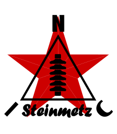

<p align="center">
  
</p>

★ N.I.C. ★

# Steinmetz — повреждения на линиях электропередачи, с автомобиля или с площадки

[English](README.md) · [Čeština](README.cs.md) · **Русский**

> **Концепция на стадии проектирования — ничего не построено.** Цифры проверяются по даташитам и самим компонентам, прежде чем будет сделана плата.

**Steinmetz — это плата Tesla со своим собственным образом: NodBus тип 13, NOD.** Образ делает
одно: находит и классифицирует импульсные источники на линии электропередачи, привязанные к частоте
сети, — дугу, корону, частичные разряды, — и весь H7A3 отдан этой задаче и ничему больше. Блок
одинаков на крыше автомобиля при 80–100 km/h и на мачте на стационарной площадке; между этими
вариантами ничего не устанавливается и не снимается.

- **Плата — от Tesla, идентична до последнего компонента** — три стержня, тракт, преобразователь,
  шины питания, оба разъёма данных. Три полосы остаются; **входной каскад ослаблен на 20 dB** на собственных клеммах аттенюатора Tesla, так что
  линия над машиной оказывается внутри диапазона, а горизонт молний сокращается до 350–700 km
  (`HARDWARE.md`); образ рассчитан на линию, а не на грозу за горизонтом
  (`FIRMWARE.md`).
- **Он подключается к станции, как любой блок**, на конце линии со стороны блока: коммуникационная
  плата для его среды передачи и 12 V на его клеммах. В автомобиле станция — это Proteus в салоне
  (`../../proteus/`), линия — **один гибридный кабель на крышу** через один кабельный ввод; антенна
  GNSS стоит на лобовом стекле, приёмник — на Kronos, как в каждой станции.
- **Запись — событие Tesla размером 4 B**, смещение и амплитуда без изменений, два бита типа
  означают **0 дуга · 1 корона · 2 частичный разряд · 3 UFO**; уровень шумов и состояния источников
  идут во втором NOD, как у Tesla. **Что из этого делает сервер**: TOA между блоками вдоль линии,
  положение которой известно, — это одна неизвестная координата; при привязке по переднему фронту
  ~1 000 срабатываний за эпизод дают 30–35 dB, а пара блоков по обе стороны от повреждения разрешает
  ~150 m — короткий список опор, а тревога — это источник, который за несколько дней меняет класс
  с UFO на дугу.

Назван в честь **Charles Proteus Steinmetz**, который вывел арифметику переходных процессов в линиях
электропередачи и создал молнию в лаборатории, чтобы их испытать.

## Как он подключён к станции

```
  roof / mast                                       cabin / enclosure
  ┌─────────────────────────────┐   hybrid cable    ┌──────────────────────────────────────────────────────┐
  │ Tesla's board, Steinmetz's  │ 4 pairs + 2 cores │ PROTEUS — Mayak · Kronos · Bifrost                   │
  │ image, type 13              │◀═════════════════▶│ port 1 — the 485 island, 4 pairs on terminals        │
  │   NB IN  ◀─ communication   │  one gland each   │ PWR OUT 1 — the 12 V across a barrier                │
  │           board             │                   │ Polaris on Kronos — coax — antenna on the windscreen │
  │   12V    ◀─ terminals       │                   │ Wi-Fi · modem · Ethernet · USB                       │
  │   3 rods                    │                   └──────────────────────────────────────────────────────┘
  └─────────────────────────────┘
```

## Файлы

| файл | содержание |
|---|---|
| [`HARDWARE.md`](HARDWARE.md) | чем отличается от сборки Tesla: линк на крышу, питание линии, питание от автомобиля, антенна, корпус. Плата — `../HARDWARE.md`, целиком |
| [`CONSTRUCTION.md`](CONSTRUCTION.md) | крепление на автомобиль — коробка на поперечинах багажника, крыша под стержнями, кабель, собственные помехи автомобиля; стационарная площадка строится как Tesla |
| [`FIRMWARE.md`](FIRMWARE.md) | образ — четыре класса записи, регистры, которые он фиксирует, что центральный блок делает для движущегося блока, что образ оставляет незадействованным |
| [`WHY.md`](WHY.md) | собственное кладбище Steinmetz; кладбище платы — `../WHY.md` |

## Лицензия

Аппаратная часть: CERN-OHL-S v2 (`../../LICENSE-HW`) · Программы: MIT (`../../LICENSE`) — Copyright (c) 2026 NIC — Native Intellect Community
